# GPU-Accelerated Operators for Renoir

## Table of Contents

1. [Introduction](#introduction)
2. [Theoretical Background](#theoretical-background)
   - [CPU vs GPU Architecture](#cpu-vs-gpu-architecture)
   - [GPU Memory Hierarchy](#gpu-memory-hierarchy)
   - [SIMT Execution Model](#simt-execution-model)
   - [Performance Optimization Concepts](#performance-optimization-concepts)
3. [The Black-Scholes Model](#the-black-scholes-example)
4. [The Monte Carlo Model](#the-monte-carlo-model)
5. [The CubeCL Framework](#the-cubecl-framework)
6. [The map_gpu Operator](#the-map_gpu-operator)
7. [The reduce_gpu Operator](#the-reduce_gpu-operator)
8. [Implementing GPU Kernels](#implementing-gpu-kernels)
9. [GPU Programming Concepts](#gpu-programming-concepts)
10. [GPU Parallelization Strategy](#gpu-parallelization-strategy)
11. [Step-by-Step GPU Computation Example](#step-by-step-gpu-computation-example)
12. [Performance Bottlenecks and Optimizations](#performance-bottlenecks-and-optimizations)
13. [Why Speedup Drops After 250M Options](#why-speedup-drops-after-250m-options-large-problem-sizes)
14. [Batching Strategies](#batching-strategies)
15. [GPU Context and Backend Selection](#gpu-context-and-backend-selection)
16. [Quick Start Guide](#quick-start-guide)
17. [Project Structure](#project-structure)
18. [Running the Examples](#running-the-examples)
19. [Running Benchmarks](#running-benchmarks)
20. [Generating Charts](#generating-charts)
21. [Performance Considerations](#performance-considerations)
22. [API Reference](#api-reference)
23. [Benchmark Results](#benchmark-results-and-analysis)
24. [Monte Carlo Benchmark](#monte-carlo-benchmark)
25. [Reduce Benchmark](#reduce-benchmark)
26. [Evaluation](#evaluation)
27. [Black-Scholes Kernel Improvements](#black-scholes-kernel-improvements)
28. [GPU Kernel Integration Tests](#gpu-kernel-integration-tests)
29. [References](#references)


---

## Introduction

Renoir's GPU acceleration module provides two streaming operators that offload computation to the GPU using the [CubeCL](https://github.com/tracel-ai/cubecl) library:

- **`map_gpu`** -- element-wise transformations (e.g., Black-Scholes pricing, Monte Carlo simulation)
- **`reduce_gpu`** -- parallel reductions (Sum, Product, Min, Max)

Both operators integrate seamlessly into Renoir's dataflow pipeline and support WGPU (cross-platform) and CUDA (NVIDIA) backends.

### When to Use GPU Operators

| Use `map_gpu` / `reduce_gpu` when: | Use standard `map` / `reduce` when: |
|-------------------------------------|--------------------------------------|
| Processing 75,000+ items | Processing < 10,000 items |
| Compute-intensive transformations | Simple transformations |
| Highly parallel workloads | Complex branching logic |
| Numerical/scientific computing | String processing |
| Available GPU hardware | CPU-only environments |

### Supported Backends

The `map_gpu` operator supports multiple GPU backends through CubeCL:

| Backend | Feature Flag | Platforms | GPU Support |
|---------|--------------|-----------|-------------|
| **WGPU** | `gpu-wgpu` | macOS, Windows, Linux, Web | AMD, NVIDIA, Intel, Apple Silicon |
| **CUDA** | `gpu-cuda` | Linux, Windows | NVIDIA only |

> [!TIP]
> **For most users, `gpu-wgpu` is recommended** as it provides cross-platform compatibility across all major GPU vendors.

#### WGPU: Cross-Platform GPU Abstraction

WGPU is a cross-platform graphics abstraction layer that automatically selects the best native API for your system:

| Platform | Native API | Supported GPUs |
|----------|------------|----------------|
| **macOS** | Metal | Apple Silicon (M1/M2/M3), AMD (older Macs) |
| **Linux** | Vulkan | AMD (RDNA/RDNA2/RDNA3), NVIDIA, Intel |
| **Windows** | DirectX 12 / Vulkan | AMD, NVIDIA, Intel |
| **Web (WASM)** | WebGPU | Browser-dependent |

This means you can run the same code on:
- **Apple M1/M2/M3** Macs (via Metal)
- **AMD Radeon** GPUs on Linux/Windows (via Vulkan/DX12)
- **NVIDIA GeForce/RTX** GPUs on any platform (via Vulkan/DX12)
- **Intel Arc** GPUs (via Vulkan/DX12)

#### CUDA: NVIDIA-Specific Optimization

The `gpu-cuda` backend provides direct CUDA access for NVIDIA GPUs, which may offer:
- Lower driver overhead
- Access to NVIDIA-specific features (Tensor Cores, etc.)
- Slightly better performance on some workloads

However, it **only works on NVIDIA hardware** and requires the CUDA toolkit to be installed.

---

## Theoretical Background

This section provides a comprehensive theoretical foundation for understanding GPU-accelerated computing. We examine the fundamental architectural differences between CPUs and GPUs, explore memory hierarchies and their performance implications, analyze the SIMT execution model, and detail the optimization techniques essential for achieving high-performance GPU computation.

### CPU vs GPU Architecture

Modern processors can be broadly categorized into two distinct architectural paradigms: **latency-optimized** processors (CPUs) and **throughput-optimized** processors (GPUs) [1][2]. Understanding these fundamental differences is crucial for effective heterogeneous computing.

#### The Latency vs Throughput Trade-off

The fundamental design choice in processor architecture is the trade-off between **latency** (time to complete a single task) and **throughput** (number of tasks completed per unit time) [2]:

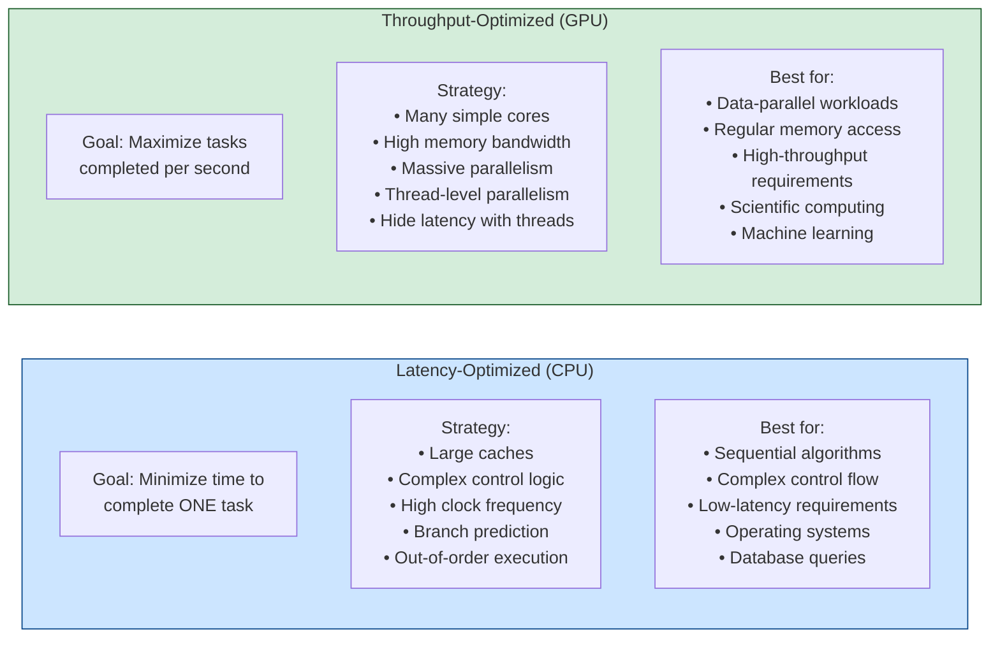

#### Central Processing Unit (CPU) Architecture

CPUs are designed as general-purpose processors optimized for **low-latency** execution of sequential tasks. A modern CPU dedicates approximately 50% of its die area to control logic and cache, with only a small portion for actual computation [1][2].

**CPU Core Architecture:**

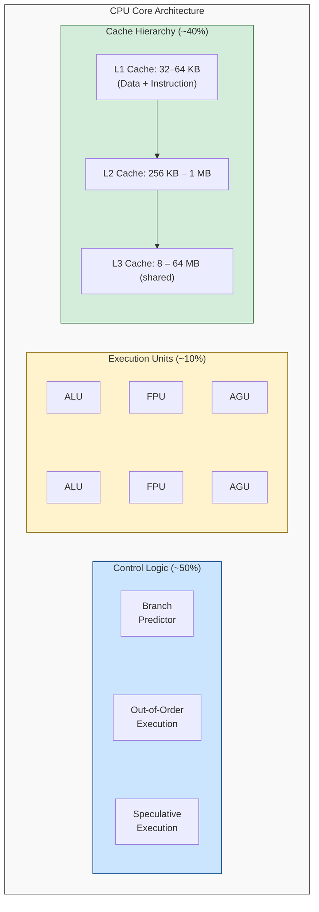

> **ALU** = Arithmetic Logic Unit | **FPU** = Floating Point Unit | **AGU** = Address Generation Unit

**CPU Component Details:**

| Component | Description | Typical Values |
|-----------|-------------|----------------|
| **Cores** | Independent processing units with full instruction pipelines | 4-64 cores |
| **ALUs per Core** | Integer arithmetic and logic operations | 4-8 per core |
| **FPUs per Core** | Floating-point arithmetic (add, multiply, divide) | 2-4 per core |
| **Clock Frequency** | Cycles per second; higher = faster sequential execution | 3.0-5.5 GHz |
| **L1 Cache** | Fastest cache, per-core, ~4 cycle latency | 32-64 KB |
| **L2 Cache** | Medium-speed cache, per-core, ~12 cycle latency | 256 KB - 1 MB |
| **L3 Cache** | Shared across cores, ~40 cycle latency | 8-64 MB |
| **SIMD Width** | Vector instruction width (SSE=128-bit, AVX=256/512-bit) | 128-512 bits |

**CPU Latency-Reduction Mechanisms:**

1. **Branch Prediction**: Modern CPUs achieve 95-99% prediction accuracy, speculatively executing instructions before branch resolution to avoid pipeline stalls.

2. **Out-of-Order Execution**: Instructions execute as soon as their operands are available, not in strict program order, maximizing ALU utilization.

3. **Speculative Execution**: The CPU predicts likely code paths and executes them ahead of time; mispredictions incur a penalty but correct predictions save cycles.

4. **Prefetching**: Hardware automatically fetches data into cache before it's needed, based on memory access pattern analysis.

#### Graphics Processing Unit (GPU) Architecture

GPUs are designed for **high-throughput** parallel execution of many similar tasks. Unlike CPUs, GPUs dedicate the majority of their die area to execution units, accepting higher latency per operation in exchange for massive parallelism [1][2].

**GPU Architecture Overview:**

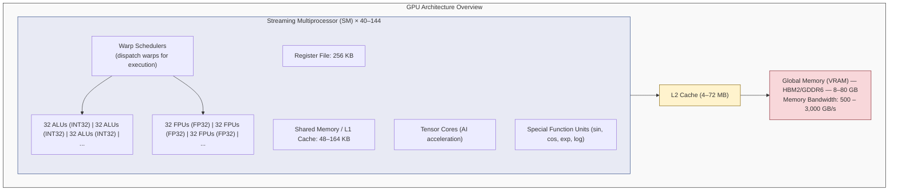

**GPU Component Details:**

| Component | Description | Typical Values |
|-----------|-------------|----------------|
| **Streaming Multiprocessors (SMs)** | Independent processing units, each containing multiple execution units | 40-144 SMs |
| **CUDA Cores / Stream Processors** | Simple ALUs for parallel integer and floating-point operations | 2,000-16,000+ |
| **FP32 Units** | Single-precision floating-point arithmetic operations | 64-128 per SM |
| **FP64 Units** | Double-precision floating-point (often 1/2 or 1/64 of FP32) | 32-64 per SM |
| **Tensor Cores** | Matrix multiply-accumulate units for AI workloads | 4-8 per SM |
| **Special Function Units (SFU)** | Transcendental functions (sin, cos, exp, log, sqrt) | 4-16 per SM |
| **Warp Schedulers** | Hardware units that select and dispatch warps for execution | 4 per SM |
| **Register File** | Per-SM fast storage for thread state | 256 KB per SM |
| **Shared Memory** | Per-SM programmable cache shared by threads in a block | 48-164 KB per SM |
| **Memory Bandwidth** | Global memory throughput | 500-3,000 GB/s |

#### Architectural Comparison Summary

| Metric | CPU (Modern Desktop) | GPU (Modern HPC) |
|--------|---------------------|-------------------|
| **Cores** | 8–24 | 5,000–16,000 (simple) |
| **Clock Speed** | 3.5–5.5 GHz | 1.5–2.5 GHz |
| **Peak FP32 TFLOPS** | 0.5–2 | 10–80 |
| **Peak FP64 TFLOPS** | 0.25–1 | 5–40 (HPC GPUs) |
| **Memory Bandwidth** | 50–100 GB/s | 500–3,000 GB/s |
| **Cache** | 64+ MB (L1+L2+L3) | 4–72 MB (L2) |
| **Die Area (Control)** | ~50% | ~10% |
| **Die Area (Compute)** | ~10% | ~70% |
| **Power (TDP)** | 65–250W | 150–700W |
| **Best For** | Latency-sensitive | Throughput-intensive |

### GPU Memory Hierarchy

GPU memory is organized in a hierarchy that trades off capacity for access latency and bandwidth [3][4]. Understanding this hierarchy is essential for achieving optimal performance.

**Memory Hierarchy Visualization:**

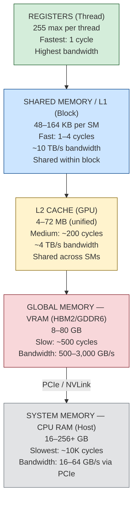

**Memory Type Characteristics:**

| Memory Type | Scope | Size | Latency | Bandwidth | Persistence |
|-------------|-------|------|---------|-----------|-------------|
| **Registers** | Per-thread | 255 × 32-bit per thread | 1 cycle | ~20 TB/s | Thread lifetime |
| **Shared Memory** | Per-block | 48-164 KB per SM | 1-4 cycles | ~10 TB/s | Block lifetime |
| **L1 Cache** | Per-SM | 128-256 KB per SM | ~28 cycles | ~10 TB/s | Automatic |
| **L2 Cache** | Global | 4-72 MB | ~193 cycles | ~4 TB/s | Automatic |
| **Global Memory** | Global | 8-80 GB | ~500 cycles | 0.5-3 TB/s | Kernel lifetime |
| **Constant Memory** | Global | 64 KB | ~4 cycles (cached) | ~10 TB/s | Read-only |
| **Texture Memory** | Global | Uses global | ~400 cycles | Cached | Read-only, spatial locality |
| **System Memory** | Host | Varies | ~10,000 cycles | 16-64 GB/s | Program lifetime |

### SIMT Execution Model

Modern GPUs use the **Single Instruction, Multiple Threads (SIMT)** execution model, pioneered by NVIDIA [1][2]. This model extends the traditional SIMD (Single Instruction, Multiple Data) paradigm with thread-level abstraction.

#### SIMD vs SIMT Comparison

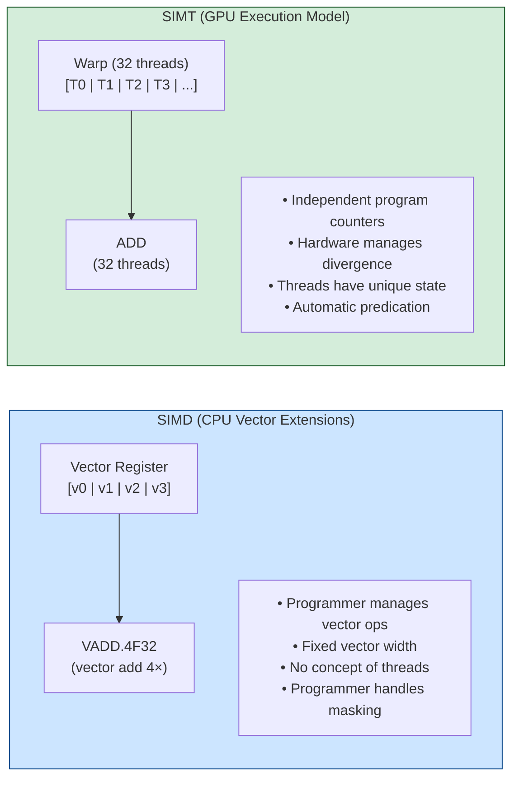

| Aspect | SIMD (CPU) | SIMT (GPU) |
|--------|------------|------------|
| **Full Name** | Single Instruction, Multiple Data | Single Instruction, Multiple Threads |
| **Programming Model** | Explicit vector intrinsics or compiler auto-vectorization | Independent scalar threads grouped into warps |
| **Divergence Handling** | Programmer must handle with masking | Hardware-managed with predication |
| **Thread Independence** | No thread concept; single control flow | Each thread has own registers, can diverge |
| **Vector Width** | Fixed (128/256/512 bits) | Dynamic (warp size × data type) |
| **Examples** | Intel SSE/AVX/AVX-512, ARM NEON | NVIDIA CUDA, AMD RDNA, Apple Metal |

#### Warps and Wavefronts

Threads are organized into groups that execute in lockstep [1][2]:

- **Warp** (NVIDIA): 32 threads executing the same instruction simultaneously
- **Wavefront** (AMD): 32 or 64 threads (architecture-dependent)
- **Subgroup** (Vulkan/WebGPU): Platform-independent term, typically 32 threads

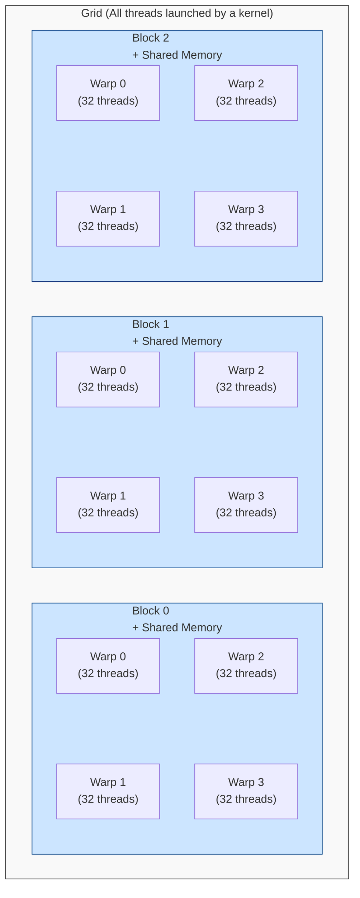

> **Warp** = 32 threads executing SAME instruction in lockstep | **Block** = Multiple warps sharing the same shared memory | **Grid** = All blocks launched by a single kernel

#### Branch Divergence

When threads within a warp take different branches, the GPU serializes execution [1][2]:

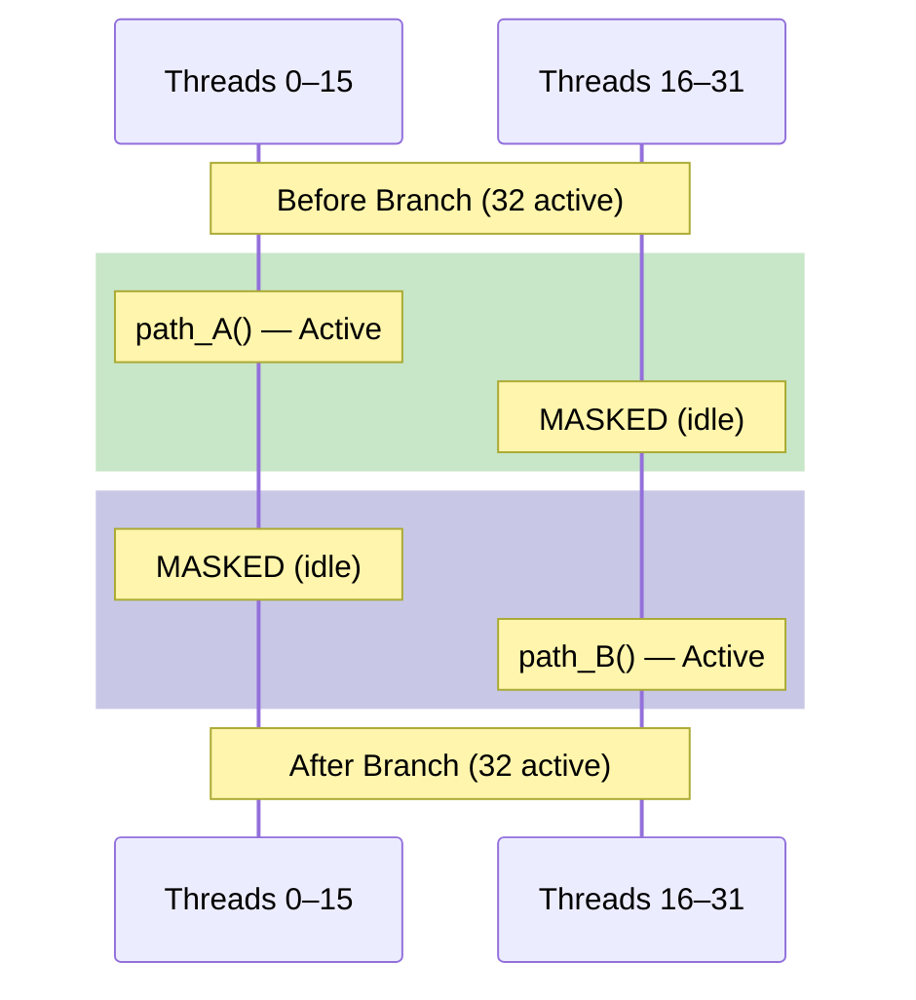

> **Performance Impact:** Both paths execute sequentially, doubling the time.
> **Best Practice:** Minimize divergence; align branches with warp boundaries.

### Performance Optimization Concepts

#### Occupancy

**Occupancy** measures how effectively the GPU's computational resources are utilized [3]. It is defined as the ratio of active warps to the maximum number of warps an SM can support:

```
Occupancy = (Active Warps per SM) / (Maximum Warps per SM)
```

**Factors Limiting Occupancy:**

| Factor | How It Limits Occupancy | Mitigation |
|--------|-------------------------|------------|
| **Register Usage** | More registers per thread → fewer threads per SM | Reduce register pressure |
| **Shared Memory** | More shared memory per block → fewer blocks per SM | Optimize shared memory usage |
| **Block Size** | Too small = poor occupancy; too large = resource issues | Use 128-256 threads per block |
| **Maximum Threads/Block** | Hardware limit (typically 1024) | Split work across blocks |

**Occupancy vs Performance:**

```
   Performance
        │
        │      ╱─────────────────────
        │     ╱
        │    ╱
        │   ╱
        │──╱     Diminishing returns above 50% occupancy
        │ ╱      (for compute-bound kernels)
        │╱
        └──────────────────────────────────
                20%    40%    60%    80%   100%
                           Occupancy

   Note: Higher occupancy is not always better!
   Memory-bound kernels may perform well at lower occupancy.
   Compute-bound kernels benefit more from higher occupancy.
```

#### Latency Hiding

GPUs hide memory latency through **massive thread-level parallelism** rather than large caches [2][3]:

```mermaid
gantt
    title Latency Hiding — SM switches between warps to keep ALUs busy
    dateFormat X
    axisFormat %s

    section Warp 0
    Compute     :a0, 0, 50
    Memory Load :crit, m0, 50, 550
    Compute     :a0b, 550, 600

    section Warp 1
    Compute     :a1, 100, 150
    Memory Load :crit, m1, 150, 650

    section Warp 2
    Compute     :a2, 200, 250
    Memory Load :crit, m2, 250, 750

    section Warp 3
    Compute     :a3, 300, 350
    Memory Load :crit, m3, 350, 850
```

> **Problem:** Memory access takes ~500 cycles, but ALU operations take ~4 cycles.
> **Solution:** Execute other warps while waiting for memory. SM keeps switching between warps, so ALUs are always busy.
> **Required Occupancy:** Warps Needed >= Memory Latency / Compute Latency (e.g., 500 / 4 = 125 warps)

#### Memory Coalescing

For optimal memory bandwidth utilization, threads in a warp should access **contiguous memory addresses** [3][4]:

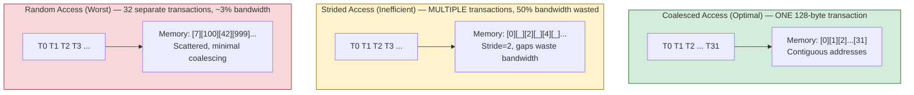

| Access Pattern | Transactions | Effective Bandwidth |
|---------------|-------------|---------------------|
| Coalesced | 1 | 100% |
| Stride-2 | 2 | 50% |
| Stride-4 | 4 | 25% |
| Random | 32 | ~3% |

#### Vectorization (SIMD within SIMT)

GPUs can process multiple data elements per thread using **vector types** [5]. This combines the SIMT execution model with SIMD-style data parallelism:

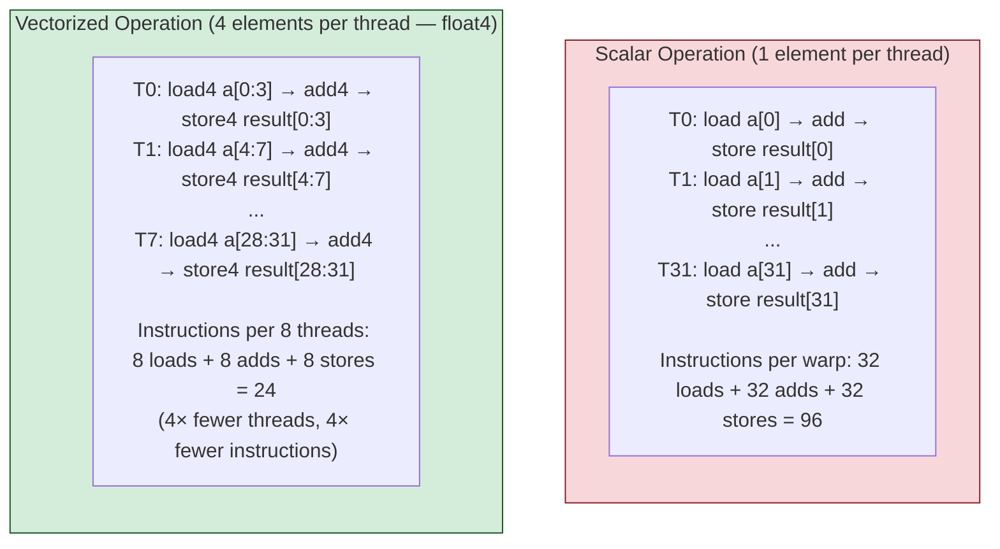

**CubeCL Vectorization Example:**

```rust
// Line<f32> with vectorization_factor=4 processes 4 floats at once
#[cube]
fn add_vectors<F: Float>(a: &Array<Line<F>>, b: &Array<Line<F>>,
                         out: &mut Array<Line<F>>) {
    let idx = ABSOLUTE_POS;
    out[idx] = a[idx] + b[idx];  // Adds 4 floats simultaneously
}
```

**Vectorization Benefits:**

| Benefit | Description |
|---------|-------------|
| **Reduced Instruction Count** | Fewer instructions to issue and decode |
| **Better Memory Bandwidth** | Wider loads/stores better utilize memory bus |
| **Improved ALU Utilization** | Vector ALUs operate on multiple elements |
| **Lower Register Pressure** | Fewer loop iterations, fewer temporaries |

---

## The Black-Scholes Example

The **Black-Scholes model** [6], developed by Fischer Black and Myron Scholes in 1973, provides a closed-form solution for pricing European-style options. It is used as a reference implementation to demonstrate GPU acceleration because:

1. **Perfectly parallel**: Each option can be priced independently (embarrassingly parallel)
2. **Compute-intensive**: ~40 floating-point operations per option (exp, log, sqrt, erf)
3. **Real-world application**: Widely used in quantitative finance and risk management
4. **Numerical stability**: Well-understood computational characteristics

### The Black-Scholes Formula

The Black-Scholes formula calculates the theoretical price of European call and put options [6]:

**Call Option Price:**
$$C = S \cdot N(d_1) - K \cdot e^{-rT} \cdot N(d_2)$$

**Put Option Price (via put-call parity):**
$$P = C - S + K \cdot e^{-rT}$$

**Intermediate Values:**
$$d_1 = \frac{\ln(S/K) + (r + \sigma^2/2)T}{\sigma\sqrt{T}}$$
$$d_2 = d_1 - \sigma\sqrt{T}$$

**Variables:**

| Symbol | Name | Description |
|--------|------|-------------|
| $S$ | Spot Price | Current stock price |
| $K$ | Strike Price | Exercise price of the option |
| $T$ | Time to Expiry | Years until expiration |
| $r$ | Risk-free Rate | Annual risk-free interest rate |
| $\sigma$ | Volatility | Annual price volatility |
| $N(x)$ | CND | Cumulative Normal Distribution |

### Computational Complexity

Each option pricing requires approximately **40 floating-point operations**:

| Operation | Count |
|-----------|-------|
| Division | 4 |
| Multiplication | 12 |
| Addition/Subtraction | 8 |
| Logarithm | 1 |
| Square Root | 1 |
| Exponential | 1 |
| Error Function | 2 |
| **Total** | **~40** |

---

## The CubeCL Framework

**CubeCL** [7] is a multi-platform high-performance compute language extension for Rust, developed by Tracel AI. It provides a unified programming model for GPU computation across different backends.

### Design Philosophy

CubeCL addresses three core challenges in GPU programming [7]:

1. **Portability**: Write once, run on CUDA, Metal, Vulkan, and WebGPU
2. **Performance**: Automatic optimizations without sacrificing control
3. **Ergonomics**: Rust-native syntax and type safety

### Key Features

| Feature | Description |
|---------|-------------|
| **JIT Compilation** | Kernels compiled at runtime for target platform |
| **Automatic Vectorization** | SIMD instructions used automatically when available |
| **Comptime** | Compile-time code generation and optimization |
| **Autotuning** | Runtime benchmarking to select optimal configurations |

### Automatic Vectorization

CubeCL can automatically use SIMD instructions by specifying vectorization factor at launch time [7]:

```rust
// The Line<F> type represents vectorized data
#[cube]
fn gelu_scalar<F: Float>(x: Line<F>) -> Line<F> {
    let sqrt2 = F::new(comptime!(2.0f32.sqrt()));
    x * (Line::erf(x / Line::new(sqrt2)) + 1.0) / 2.0
}
```

### Comptime System

The comptime system allows compile-time code modification [7]:

```rust
// comptime! executes at kernel compilation, not runtime
let sqrt2 = F::new(comptime!(2.0f32.sqrt()));
```

### Supported Platforms

| Backend | Feature Flag | Native APIs |
|---------|--------------|-------------|
| **WGPU** | `wgpu` | Vulkan, Metal, DirectX 12, WebGPU |
| **CUDA** | `cuda` | NVIDIA CUDA |
| **CPU** | `cpu` | Native SIMD (AVX, NEON) |

### Integration with Renoir

Renoir uses CubeCL to implement the `map_gpu` operator, providing:

- Automatic kernel compilation for the target GPU
- Memory management and buffer allocation
- Synchronization and result collection

---

## The map_gpu Operator

### Architecture Overview

The `MapGpu` operator implements **async pipelining** for optimal GPU utilization:

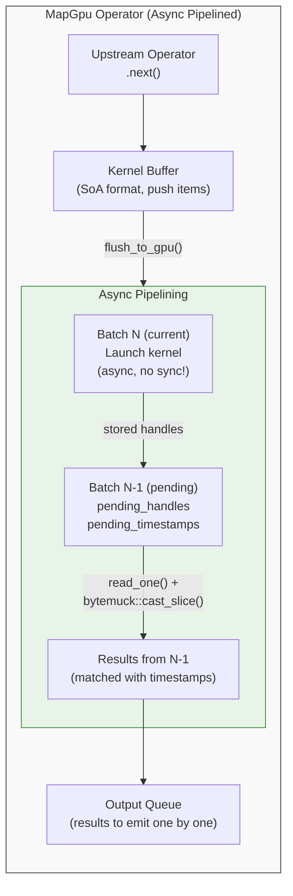

> At end of stream, `drain()` collects final pending results.
>
> **Batching Strategy:** Fixed (flush every N items, default 10M) | Timed (flush on timeout OR max size) | Adaptive (adapt batch size based on throughput)

### Async Pipelining Benefits

| Metric | Without Pipelining | With Pipelining | Improvement |
|--------|-------------------|-----------------|-------------|
| **GPU vs CPU Seq** | 1.8x faster | **4.9x faster** | 2.7x |
| **GPU vs CPU Par** | 0.35x (slower) | **0.92x** (near parity) | 2.6x |
| **Flush overhead** | ~60ms (10M items) | **~20ms** | 3x |

### Data Flow (Pipelined)

1. **Input**: Items arrive via `prev.next()` from upstream operator
2. **Push to kernel**: Items pushed directly to kernel's SoA buffer (no intermediate copy)
3. **Flush Trigger**: When batch is ready, `flush_to_gpu()` is called
4. **Collect Previous**: First, collect results from PREVIOUS batch (if any)
5. **Launch Current**: Launch GPU kernel for current batch (async, no sync wait!)
6. **Store Handles**: Store GPU handles and timestamps for next flush to collect
7. **Output Queue**: Previous batch results paired with timestamps, added to queue
8. **End of Stream**: `drain()` called to collect final pending results

### Stream Element Handling

| Element Type | Behavior |
|--------------|----------|
| `Item(x)` | Push to kernel buffer |
| `Timestamped(x, ts)` | Push with timestamp preserved |
| `Watermark(ts)` | Track max watermark |
| `FlushBatch` | Force immediate GPU flush |
| `FlushAndRestart` | Flush + drain, then signal iteration boundary |
| `Terminate` | Flush + drain remaining items, then terminate |

---

## The reduce_gpu Operator

The `reduce_gpu` operator performs GPU-accelerated parallel reductions on streaming data. It supports four built-in reduction kernels (Sum, Product, Min, Max) and uses CubeCL's multi-pass reduction algorithm for high-throughput aggregation.

### Architecture Overview

Unlike `map_gpu` which transforms each element independently, `reduce_gpu` accumulates stream elements into a single scalar result using a GPU-accelerated reduction tree:

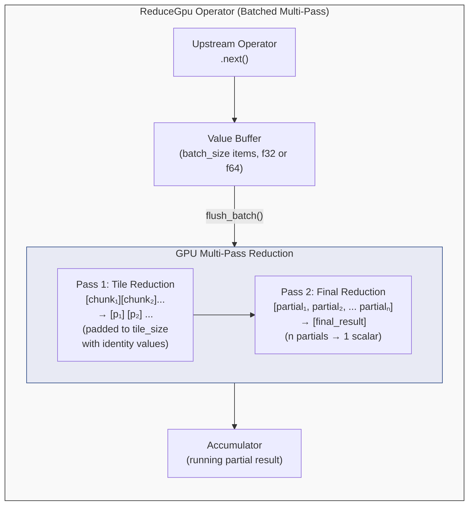

> On Terminate: emit accumulated result as single output element.

### Supported Reduction Kernels

| Kernel | Operation | Identity Value | Use Case |
|--------|-----------|----------------|----------|
| `ReduceKernel::Sum` | `a + b` | `0.0` | Aggregation, averages |
| `ReduceKernel::Product` | `a × b` | `1.0` | Cumulative products |
| `ReduceKernel::Min` | `min(a, b)` | `+∞` | Finding minimums |
| `ReduceKernel::Max` | `max(a, b)` | `-∞` | Finding maximums |

### Configuration

```rust
pub struct ReduceGpuConfig {
    pub batch_size: usize,           // Items buffered before GPU flush (default: 65,536)
    pub backend: ReduceGpuBackend,   // Auto, Wgpu, or Cuda
    pub tile_size: usize,            // Elements per GPU reduction tile (default: 262,144)
}
```

| Parameter | Default | Description |
|-----------|---------|-------------|
| `batch_size` | 65,536 (512 KiB) | Number of elements buffered before triggering a GPU reduction pass |
| `tile_size` | 262,144 (1 MiB) | Elements per tile in the first reduction pass |
| `backend` | `Auto` | GPU backend selection: `Auto`, `Wgpu`, or `Cuda` |

### Precision Handling

| Backend | GPU Precision | Public API | Conversion |
|---------|--------------|------------|------------|
| WGPU | `f32` | `f64` | Automatic `f64 ↔ f32` at API boundaries |
| CUDA | `f64` | `f64` | Native, no conversion needed |

> **Note:** WGPU uses `f32` precision internally, which may introduce small rounding errors for reductions over very large datasets. CUDA preserves full `f64` precision.

### Usage Examples

**Simple reduction with defaults:**

```rust
use renoir::prelude::*;
use renoir::operator::ReduceKernel;

let env = StreamContext::new_local();
let result = env
    .stream_iter(0..1_000_000)
    .map(|x| x as f64)
    .reduce_gpu(ReduceKernel::Sum)
    .collect_vec();

env.execute_blocking();
// result contains a single f64 with the sum
```

**Custom configuration:**

```rust
use renoir::operator::{ReduceGpuConfig, ReduceGpuBackend, ReduceKernel};

let config = ReduceGpuConfig::default()
    .with_batch_size(1_000_000)
    .with_tile_size(262_144)
    .with_backend(ReduceGpuBackend::Wgpu);

let result = env
    .stream_iter(data.into_iter())
    .reduce_gpu_with(ReduceKernel::Max, config)
    .collect_vec();
```

### Multi-Pass Reduction Algorithm

The GPU reduction uses a two-pass approach via CubeCL's `reduce` module:

1. **Pass 1 (Tile Reduction):** The input batch is reshaped into a 2D tensor `[num_tiles, tile_size]`. Each tile is reduced along the column dimension, producing `num_tiles` partial results.

2. **Pass 2 (Final Reduction):** The partial results are reduced to a single scalar value.

This approach maps efficiently to GPU hardware because:
- Each tile's reduction runs as an independent workgroup
- Within each workgroup, threads cooperate via shared memory
- The two-pass structure minimizes global memory traffic

---

## Implementing GPU Kernels

### The GpuKernel Trait

To create a GPU-accelerated transformation, implement the `GpuKernel` trait:

```rust
pub trait GpuKernel: Clone + Send + 'static {
    /// Input element type (must be bytemuck::Pod)
    type Input: Data + bytemuck::Pod;
    
    /// Output element type (must be bytemuck::Pod)
    type Output: Data + bytemuck::Pod;
    
    /// Push a single item to the kernel's internal buffer.
    /// Items are accumulated in an efficient format (e.g., SoA) for GPU processing.
    fn push(&mut self, item: Self::Input);
    
    /// Get the current number of items in the buffer.
    fn buffer_len(&self) -> usize;
    
    /// Flush the buffer to GPU and return results.
    /// 
    /// For **pipelined kernels**: Returns results from the PREVIOUS batch.
    /// The current batch is launched async and results collected on next flush.
    /// 
    /// For **non-pipelined kernels**: Returns results from the current batch.
    fn flush(&mut self, ctx: &GpuContext) -> Vec<Self::Output>;
    
    /// Drain any pending results from async pipelining.
    /// Called at end of stream to collect final batch results.
    /// Returns empty vector for non-pipelined kernels.
    fn drain(&mut self, _ctx: &GpuContext) -> Vec<Self::Output> {
        Vec::new()
    }
    
    /// Optional: hint for preferred batch size
    fn preferred_batch_size(&self) -> Option<usize> { None }
    
    /// Optional: one-time initialization (shader compilation, buffer allocation)
    fn setup(&mut self, _ctx: &GpuContext) {}
    
    /// Legacy API: execute on a batch (default uses push + flush)
    fn execute(&mut self, ctx: &GpuContext, inputs: &[Self::Input]) -> Vec<Self::Output> {
        for input in inputs {
            self.push(input.clone());
        }
        self.flush(ctx)
    }
}
```

### Pipelined vs Non-Pipelined Kernels

| Kernel Type | flush() Returns | drain() Returns | When to Use |
|-------------|-----------------|-----------------|-------------|
| **Non-pipelined** | Current batch | Empty | Simple kernels, low latency |
| **Pipelined** | Previous batch | Final batch | High throughput, overlapping compute |

### Type Requirements

Input and output types must satisfy:

1. **`Data`** (Clone + Send + 'static): Required for Renoir stream processing
2. **`bytemuck::Pod`**: "Plain Old Data" for safe GPU memory transfer

```rust
use bytemuck::{Pod, Zeroable};
use serde::{Serialize, Deserialize};

#[derive(Clone, Copy, Pod, Zeroable, Serialize, Deserialize)]
#[repr(C)]  // Consistent memory layout
struct MyInput {
    value: f32,
    scale: f32,
}

#[derive(Clone, Copy, Pod, Zeroable, Serialize, Deserialize)]
#[repr(C)]
struct MyOutput {
    result: f32,
}
```

### Complete Kernel Example

Here's a simplified example (see `examples/black_scholes_gpu.rs` for the full implementation):

```rust
use renoir::operator::gpu::{GpuKernel, GpuContext};
use cubecl::prelude::*;

#[derive(Clone, Default)]
struct SquareKernel;

impl GpuKernel for SquareKernel {
    type Input = MyInput;
    type Output = MyOutput;

    fn execute(&self, ctx: &GpuContext, inputs: &[Self::Input]) -> Vec<Self::Output> {
        if inputs.is_empty() {
            return Vec::new();
        }

        let client = ctx.client();
        let num_items = inputs.len();

        // 1. Prepare data for GPU
        let values: Vec<f32> = inputs.iter().map(|i| i.value).collect();
        
        // 2. Allocate GPU buffers
        let input_handle = client.create(f32::as_bytes(&values));
        let output_handle = client.empty(num_items * std::mem::size_of::<f32>());

        // 3. Launch kernel (using CubeCL)
        // ... kernel launch code ...

        // 4. Synchronize
        ctx.sync();

        // 5. Read results
        let result_bytes = client.read_one(output_handle).to_vec();
        
        // 6. Convert to output type
        result_bytes
            .chunks_exact(4)
            .map(|b| MyOutput {
                result: f32::from_le_bytes([b[0], b[1], b[2], b[3]]),
            })
            .collect()
    }
}
```

---

## GPU Programming Concepts

This section explains the GPU-specific concepts used in kernel implementations. Understanding these concepts is essential for writing efficient GPU kernels.

### Technology Stack

- **CubeCL**: A Rust library that compiles GPU kernels to multiple backends
- **WGPU**: WebGPU implementation supporting Metal (macOS), Vulkan, DirectX
- **CUDA**: NVIDIA's proprietary GPU computing platform

### The GPU Kernel Structure

The kernel is the code that runs on each GPU thread. Here's the Black-Scholes kernel as an example:

```rust
#[cube(launch_unchecked)]
fn black_scholes_kernel<F: Float>(
    stock_prices: &Array<Line<F>>,
    strike_prices: &Array<Line<F>>,
    time_to_expirations: &Array<Line<F>>,
    risk_free_rates: &Array<Line<F>>,
    volatilises: &Array<Line<F>>,
    call_results: &mut Array<Line<F>>,
    put_results: &mut Array<Line<F>>,
) {
    // ABSOLUTE_POS = unique global thread ID
    if ABSOLUTE_POS < stock_prices.len() {
        // Load inputs (vectorized: 4 values per thread)
        let s = stock_prices[ABSOLUTE_POS];
        let k = strike_prices[ABSOLUTE_POS];
        let t = time_to_expirations[ABSOLUTE_POS];
        let r = risk_free_rates[ABSOLUTE_POS];
        let v = volatilises[ABSOLUTE_POS];

        // Calculate d1 and d2
        let sqrt_t = Line::sqrt(t);
        let v_sqrt_t = v * sqrt_t;
        let d1 = (Line::log(s / k) + (r + v * v * Line::new(F::new(0.5))) * t) / v_sqrt_t;
        let d2 = d1 - v_sqrt_t;

        // Calculate N(d1) and N(d2) using error function
        let sqrt_2 = Line::new(F::new(std::f32::consts::SQRT_2));
        let cnd_d1 = (Line::new(F::new(1.0)) + Line::erf(d1 / sqrt_2)) * Line::new(F::new(0.5));
        let cnd_d2 = (Line::new(F::new(1.0)) + Line::erf(d2 / sqrt_2)) * Line::new(F::new(0.5));
        
        // Calculate prices
        let exp_rt = Line::exp(-r * t);
        call_results[ABSOLUTE_POS] = s * cnd_d1 - k * exp_rt * cnd_d2;
        put_results[ABSOLUTE_POS] = call_results[ABSOLUTE_POS] - s + k * exp_rt;
    }
}
```

### Key GPU Concepts

#### 1. The `#[cube]` Attribute

```rust
#[cube(launch_unchecked)]
```

This macro:
- Compiles the function to GPU shader code (WGSL for WebGPU, PTX for CUDA)
- Generates a `launch_unchecked` function for dispatching
- Enables GPU-specific optimizations

#### 2. `Line<F>` - Vectorized Types

`Line<F>` is a SIMD-like vector type that holds 4 values:

$$\text{Line<f32>} = [f_{32}, f_{32}, f_{32}, f_{32}]$$

When you write:
```rust
let result = Line::sqrt(t);
```

It computes 4 square roots simultaneously:

$$\text{result}[i] = \sqrt{t[i]} \quad \text{for } i \in \{0, 1, 2, 3\}$$

#### Why Exactly 4 Elements? (Not 8 or 16?)

The vectorization factor of 4 is **hardware-driven**, not arbitrary:

**1. GPU SIMD Width (vec4)**

GPUs are optimized for 4-component vectors because of their graphics origins (RGBA colors, XYZW coordinates). Most GPU instructions operate on 128-bit registers natively:

```
GPU Register (128-bit):
┌─────────┬─────────┬─────────┬─────────┐
│ f32[0]  │ f32[1]  │ f32[2]  │ f32[3]  │  = 4 × 32-bit = 128 bits
└─────────┴─────────┴─────────┴─────────┘
```

**2. Memory Coalescing**

When GPU threads access memory, accesses are **coalesced** (combined) for efficiency. With vectorization=4, each thread's access is 128-bit aligned:

```
Thread 0 reads: [0, 1, 2, 3]     ─┐
Thread 1 reads: [4, 5, 6, 7]      ├─→ One coalesced 512-bit memory transaction
Thread 2 reads: [8, 9, 10, 11]    │
Thread 3 reads: [12, 13, 14, 15] ─┘
```

**3. Why Not More?**

| Factor | Issue |
|--------|-------|
| **2** | Underutilizes 128-bit registers |
| **4** | Matches native vec4, optimal |
| **8** | Requires 2 memory loads, more register pressure |
| **16** | Too many registers per thread, reduces occupancy |

**Register pressure**: Each thread has limited registers (~64-256 per thread). More elements per thread = more registers = fewer threads can run simultaneously (lower **occupancy**).

**4. Hardware Evidence**

- **WGSL** (WebGPU): Native `vec4<f32>` type
- **Metal**: `float4` is fundamental
- **CUDA**: `float4` maps to a single 128-bit load
- **Vulkan/SPIR-V**: 4-component vectors are optimal

#### 3. `ABSOLUTE_POS` - Global Thread Index

Each GPU thread has a unique identifier calculated as:

$$\text{ABSOLUTE\_POS} = y \cdot (N_x \cdot D_x) + x \cdot D_x + t_x$$

Where:
- $y$ = cube Y coordinate
- $x$ = cube X coordinate  
- $N_x$ = number of cubes in X dimension
- $D_x$ = threads per cube (256)
- $t_x$ = thread index within cube

---

## GPU Parallelization Strategy

### GPU Hierarchy

| Level | Name | Size | Description |
|-------|------|------|-------------|
| Grid | All Cubes | Up to $65535 \times 65535$ | Entire dispatch |
| Cube | Workgroup | 256 threads | Executes together |
| Thread | Single unit | 1 | Processes 4 options |

### Understanding CubeDim and CubeCount

GPU kernel launches are configured with two parameters:

#### CubeDim: Threads Inside Each Cube

**CubeDim** defines how many threads run *inside* each workgroup (cube):

```rust
let cube_dim = CubeDim::new(256, 1, 1);  // 256 threads, 1D organization
```

| Dimension | Our Value | Meaning |
|-----------|-----------|---------|
| X | 256 | 256 threads in X direction |
| Y | 1 | No threads in Y direction |
| Z | 1 | No threads in Z direction |
| **Total** | **256** | 256 threads per cube |

**Why 256 threads?**
- **Power of 2**: GPU schedulers work optimally with powers of 2
- **Warp alignment**: GPUs execute in "warps" of 32 threads; 256 = 8 warps
- **Occupancy**: Balances parallelism vs register pressure
- **Standard choice**: 128-512 is typical; 256 is the sweet spot

**Why 1D (not 2D or 3D)?**

| CubeDim | Best For | Example |
|---------|----------|---------|
| `(256, 1, 1)` | Linear data, independent work | **Black-Scholes**, vector ops |
| `(16, 16, 1)` | 2D data with neighbor access | Image processing, matrix multiply |
| `(8, 8, 8)` | 3D volumetric data | Fluid simulation, 3D rendering |

Our options are stored in a **flat array** with no spatial relationship—each option is completely independent. Using 1D CubeDim:
- Ensures coalesced memory access (consecutive threads read consecutive memory)
- Simplifies indexing (`ABSOLUTE_POS` directly maps to array index)
- Avoids unnecessary complexity

#### CubeCount: Number of Cubes to Launch

**CubeCount** defines how many cubes (workgroups) to dispatch:

```rust
let cube_count = CubeCount::Static(cubes_x, cubes_y, 1);
```

The number of cubes is calculated based on workload:

$$\text{cubes\_needed} = \left\lceil \frac{\text{num\_options}}{4 \times 256} \right\rceil = \left\lceil \frac{\text{num\_options}}{1024} \right\rceil$$

**Understanding the formula:**

The denominator $4 \times 256 = 1024$ represents **options processed per cube**:

| Factor | Value | Meaning |
|--------|-------|---------|
| **4** | Vectorization factor | Each thread processes 4 options via `Line<f32>` |
| **256** | Threads per cube | CubeDim is set to 256 threads |
| **1024** | Options per cube | $256 \text{ threads} \times 4 \text{ options/thread}$ |

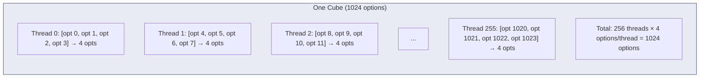

**Example calculations:**

| Options | Calculation | Cubes Needed |
|---------|-------------|--------------|
| 1,000 | $\lceil 1000/1024 \rceil$ | 1 |
| 100,000 | $\lceil 100000/1024 \rceil$ | 98 |
| 1,000,000 | $\lceil 1000000/1024 \rceil$ | 977 |
| 10,000,000 | $\lceil 10000000/1024 \rceil$ | 9,766 |
| 100,000,000 | $\lceil 100000000/1024 \rceil$ | 97,657 |

### Maximum Cube Limits

GPUs have a hardware limit of **65,535 cubes per dimension** (16-bit dispatch counter):

| Grid Type | Max Cubes | Max Options | When Used |
|-----------|-----------|-------------|-----------|
| **1D** | $65535 \times 1 \times 1$ | ~67 million | Small/medium workloads |
| **2D** | $65535 \times 65535 \times 1$ | ~4.4 trillion | Large workloads |
| **3D** | $65535^3$ | ~$2.8 \times 10^{17}$ | Theoretical max |

#### Automatic 2D Grid Scaling

The implementation automatically switches to 2D when needed:

```rust
const MAX_DISPATCH: u32 = 65535;

let (cubes_x, cubes_y) = if num_cubes_total <= MAX_DISPATCH {
    // 1D grid: All cubes fit in X dimension
    (num_cubes_total, 1)
} else {
    // 2D grid: Split across X and Y dimensions
    let cubes_y = (num_cubes_total + MAX_DISPATCH - 1) / MAX_DISPATCH;
    let cubes_x = (num_cubes_total + cubes_y - 1) / cubes_y;
    (min(cubes_x, MAX_DISPATCH), min(cubes_y, MAX_DISPATCH))
};
```

**Example: 100 million options**

```
Cubes needed: ⌈100,000,000 / 1024⌉ = 97,657 cubes
97,657 > 65,535 (exceeds 1D limit)

Switch to 2D grid:
  cubes_y = ⌈97,657 / 65,535⌉ = 2
  cubes_x = ⌈97,657 / 2⌉ = 48,829
  
Final grid: CubeCount::Static(48829, 2, 1)
Total cubes: 48,829 × 2 = 97,658 ✓
```

#### Why Not Always Use 3D?

We use 1D/2D grids because:

1. **Sufficient capacity**: 2D supports 4.4 trillion options—far beyond memory limits
2. **Simpler indexing**: Fewer dimensions = simpler `ABSOLUTE_POS` calculation
3. **Memory is the real limit**: 1 billion options needs ~28GB RAM; we hit memory limits before cube limits

```
                    Limiting Factor by Scale
                    
Options         Limit Hit
───────────────────────────────────────────────
< 67M           None (1D grid sufficient)
67M - 4.4T      None (2D grid sufficient)  
> 28GB data     MEMORY (not cube count)
───────────────────────────────────────────────
```

### Parallelization Parameters Summary

| Parameter | Value | Description |
|-----------|-------|-------------|
| **Vectorization Factor** | 4 | Options processed per thread |
| **Threads per Cube** | 256 | Workgroup size (CubeDim) |
| **Options per Cube** | 1,024 | $256 \times 4$ |
| **Max Cubes per Dimension** | 65,535 | GPU hardware limit |
| **Max Options (1D grid)** | ~67M | $65535 \times 256 \times 4$ |
| **Max Options (2D grid)** | ~4.4T | $65535^2 \times 256 \times 4$ |

### Calculating Launch Configuration

For $N$ options, the launch configuration is:

$$\text{Lines} = \lceil N / 4 \rceil$$

$$\text{Cubes} = \lceil \text{Lines} / 256 \rceil$$

**Example**: For 10 million options:

$$\text{Lines} = 10{,}000{,}000 / 4 = 2{,}500{,}000$$

$$\text{Cubes} = \lceil 2{,}500{,}000 / 256 \rceil = 9{,}766$$

Total parallel threads: $9{,}766 \times 256 = 2{,}500{,}096$

---

## Step-by-Step GPU Computation Example

Let's trace through exactly how the GPU processes 8 options, showing the data flow and parallel execution.

### Input Data (8 Options)

```
Option Index:    0      1      2      3      4      5      6      7
─────────────────────────────────────────────────────────────────────
Stock (S):     50.00  55.00  60.00  65.00  70.00  75.00  80.00  85.00
Strike (K):    52.00  54.00  58.00  62.00  68.00  72.00  78.00  82.00
Time (T):       1.00   1.00   1.00   1.00   1.00   1.00   1.00   1.00
Rate (r):       0.05   0.05   0.05   0.05   0.05   0.05   0.05   0.05
Vol (σ):        0.20   0.20   0.20   0.20   0.20   0.20   0.20   0.20
```

### GPU Thread Assignment

With vectorization factor = 4, we need **2 threads** to process 8 options:

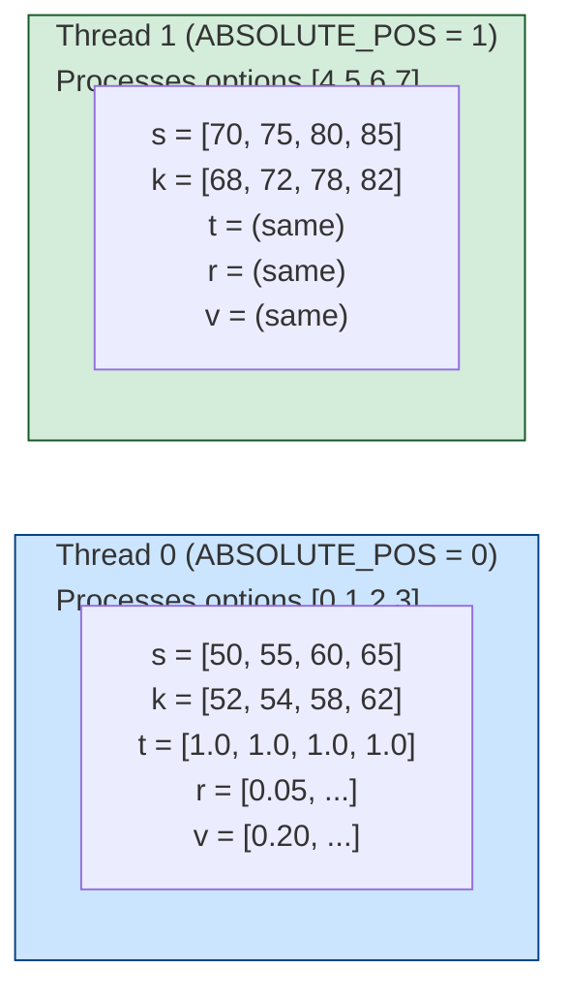

### Computation Steps (Thread 0)

**Step 1: Load Data from GPU Memory**
```rust
let s = stock_prices[0];     // s = [50.0, 55.0, 60.0, 65.0]
let k = strike_prices[0];    // k = [52.0, 54.0, 58.0, 62.0]
let t = times[0];            // t = [1.0, 1.0, 1.0, 1.0]
let r = rates[0];            // r = [0.05, 0.05, 0.05, 0.05]
let v = vols[0];             // v = [0.20, 0.20, 0.20, 0.20]
```

**Step 2: Calculate $\sqrt{T}$ and $\sigma\sqrt{T}$**
```rust
let sqrt_t = Line::sqrt(t);  
// sqrt_t = [1.0, 1.0, 1.0, 1.0]  (all computed in parallel)

let v_sqrt_t = v * sqrt_t;   
// v_sqrt_t = [0.20, 0.20, 0.20, 0.20]
```

**Step 3: Calculate $d_1$**

$$d_1 = \frac{\ln(S/K) + (r + \sigma^2/2)T}{\sigma\sqrt{T}}$$

```rust
let s_over_k = s / k;
// s_over_k = [0.9615, 1.0185, 1.0345, 1.0484]

let ln_s_k = Line::log(s_over_k);
// ln_s_k = [-0.0392, 0.0183, 0.0339, 0.0472]

let r_plus_half_v2 = r + v * v * 0.5;
// r_plus_half_v2 = [0.07, 0.07, 0.07, 0.07]

let d1_numerator = ln_s_k + r_plus_half_v2 * t;
// d1_numerator = [0.0308, 0.0883, 0.1039, 0.1172]

let d1 = d1_numerator / v_sqrt_t;
// d1 = [0.154, 0.442, 0.520, 0.586]
```

**Step 4: Calculate $d_2$**

$$d_2 = d_1 - \sigma\sqrt{T}$$

```rust
let d2 = d1 - v_sqrt_t;
// d2 = [-0.046, 0.242, 0.320, 0.386]
```

**Step 5: Calculate $N(d_1)$ and $N(d_2)$**

$$N(x) = \frac{1}{2}\left[1 + \text{erf}\left(\frac{x}{\sqrt{2}}\right)\right]$$

```rust
let sqrt_2 = 1.4142135;

let erf_d1 = Line::erf(d1 / sqrt_2);
// erf_d1 = [0.109, 0.305, 0.354, 0.394]

let cnd_d1 = (1.0 + erf_d1) * 0.5;
// cnd_d1 = [0.561, 0.671, 0.699, 0.721]  (N(d1))

let erf_d2 = Line::erf(d2 / sqrt_2);
// erf_d2 = [-0.033, 0.168, 0.222, 0.268]

let cnd_d2 = (1.0 + erf_d2) * 0.5;
// cnd_d2 = [0.482, 0.596, 0.626, 0.650]  (N(d2))
```

**Step 6: Calculate $e^{-rT}$**

```rust
let exp_rt = Line::exp(-r * t);
// exp_rt = [0.9512, 0.9512, 0.9512, 0.9512]
```

**Step 7: Calculate Call Price**

$$C = S \cdot N(d_1) - K \cdot e^{-rT} \cdot N(d_2)$$

```rust
let call = s * cnd_d1 - k * exp_rt * cnd_d2;
// call = [50×0.561 - 52×0.9512×0.482, ...]
// call = [4.20, 6.24, 8.09, 10.24]
```

**Step 8: Calculate Put Price (Put-Call Parity)**

$$P = C - S + K \cdot e^{-rT}$$

```rust
let put = call - s + k * exp_rt;
// put = [4.20 - 50 + 52×0.9512, ...]
// put = [3.67, 2.59, 1.93, 1.53]
```

**Step 9: Store Results to GPU Memory**
```rust
call_results[0] = call;  // Writes [4.20, 6.24, 8.09, 10.24]
put_results[0] = put;    // Writes [3.67, 2.59, 1.93, 1.53]
```

### Final Output

```
Option Index:    0      1      2      3      4      5      6      7
─────────────────────────────────────────────────────────────────────
Call Price:    4.20   6.24   8.09  10.24  12.67  15.36  18.29  21.45
Put Price:     3.67   2.59   1.93   1.53   1.21   0.96   0.76   0.60
```

### Parallel Execution Timeline

```
Time ──────────────────────────────────────────────────────────────→

Thread 0: ████████████████████████████████████████  (options 0-3)
Thread 1: ████████████████████████████████████████  (options 4-7)
          ↑                                      ↑
          Start (same time)                      End (same time)
          
Total: 8 options processed in the time of 1 sequential operation!
```

With 256 threads per cube and thousands of cubes, the GPU can process **millions of options simultaneously**.

---

## Performance Bottlenecks and Optimizations

Understanding where time is spent in GPU operations is critical for optimization. Detailed profiling using `samply` and internal timing instrumentation revealed the following breakdown:

### Flush Operation Timing Breakdown (10M options, without pipelining)

| Phase | Time (ms) | % of Total | Description |
|-------|-----------|------------|-------------|
| **GPU Sync** | 33-50 | 50% | Waiting for GPU kernel to complete |
| **Construct** | 10-16 | 20-25% | Converting bytes to output structs |
| **Buffer Create** | 10-12 | 12-18% | Allocating GPU buffers |
| **Read Results** | 2-4 | 5-7% | Reading results from GPU memory |
| **Kernel Launch** | 0.01 | <0.1% | Dispatching kernel (very fast) |
| **TOTAL** | ~60 | 100% | |

### Optimizations Applied

#### 1. Async Pipelining (Hides GPU Sync)

The biggest bottleneck (GPU Sync, 50%) is **hidden** by overlapping execution:

**Without Pipelining (Total: ~60ms):**

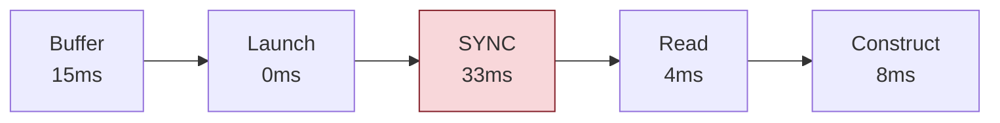

**With Pipelining (Total: ~20ms, no sync wait!):**

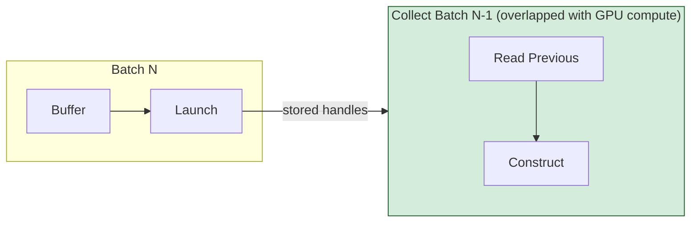

#### 2. bytemuck::cast_slice (Reduces Construct)

Instead of per-element byte conversion:

```rust
// BEFORE: ~16ms for 10M items
for (call_b, put_b) in call_chunks.zip(put_chunks) {
    results.push(BlackScholesOutput {
        call_price: f32::from_le_bytes([call_b[0], call_b[1], call_b[2], call_b[3]]),
        put_price: f32::from_le_bytes([put_b[0], put_b[1], put_b[2], put_b[3]]),
    });
}

// AFTER: ~8ms for 10M items (zero-copy reinterpretation)
let call_prices: &[f32] = bytemuck::cast_slice(&call_bytes);
let put_prices: &[f32] = bytemuck::cast_slice(&put_bytes);
for i in 0..num_options {
    results.push(BlackScholesOutput {
        call_price: call_prices[i],
        put_price: put_prices[i],
    });
}
```

#### 3. SoA (Structure of Arrays) Layout

Kernel buffers use SoA instead of AoS for better memory coalescing:

```rust
// AoS: poor cache utilization on GPU
struct AoSBuffer {
    items: Vec<BlackScholesInput>,  // [S,K,T,r,σ], [S,K,T,r,σ], ...
}

// SoA: excellent GPU memory coalescing
struct SoABuffers {
    stocks: Vec<f32>,   // [S, S, S, S, ...]
    strikes: Vec<f32>,  // [K, K, K, K, ...]
    times: Vec<f32>,    // [T, T, T, T, ...]
    rates: Vec<f32>,    // [r, r, r, r, ...]
    vols: Vec<f32>,     // [σ, σ, σ, σ, ...]
}
```

### Performance Results After Optimization

| Problem Size | Before (Seq/GPU) | After (Seq/GPU) | Improvement |
|--------------|------------------|-----------------|-------------|
| 1M options | 1.8x | **4.7x** | 2.6x |
| 5M options | 1.6x | **4.9x** | 3.1x |
| 10M options | 1.7x | **4.7x** | 2.8x |

| Metric | Before | After |
|--------|--------|-------|
| GPU vs CPU Parallel (12-core) | 0.35x (slower) | **0.92x** (near parity) |
| Peak throughput | ~130M opts/s | **~195M opts/s** |

### Crossover Point

GPU becomes faster than CPU at approximately **75,000 options**. Beyond this point, the massive parallelism of GPU outweighs the fixed overhead costs.

---

## GPU Performance Characteristics and Drop-off Analysis

This section provides a detailed analysis of GPU performance behavior across different problem sizes, explaining the observed performance peaks and drops in benchmark results.

### Performance Profile Overview

GPU performance on the Black-Scholes benchmark follows a characteristic pattern with **two distinct drop-off points**:

```
                    GPU Speedup vs CPU Sequential
                    
    7│                ┌── Peak: ~1M items
     │               ╱│   - Single batch execution
    6│              ╱ │   - Optimal GPU utilization
     │             ╱  │   - Cache-friendly working set
    5│            ╱   │
     │           ╱    │  ┌── Drop 1: Multi-batch overhead
    4│          ╱     │ ╱    - Multiple kernel launches
     │         ╱      │╱     - Synchronization points
    3│        ╱       ╲
     │       ╱         ╲    ┌── Plateau: Pipelining stabilizes
    2│      ╱           ╲__╱   performance at steady state
     │     ╱                ╲
    1│____╱                  ╲__ Drop 2: Memory pressure
     │                           - L2 cache thrashing
    0└───────────────────────────- Thermal throttling
      10K  100K  1M   10M  100M  1B
               Problem Size (options)
```

### Drop 1: Performance Peak at ~1M, Decline to ~10M

#### Root Cause: Batch Size Mismatch and Multi-Batch Overhead

The first performance drop occurs when problem sizes exceed the configured `GPU_BATCH_SIZE`. With a typical batch size of 5 million items:

| Problem Size | Number of Batches | GPU Execution Pattern |
|-------------|-------------------|----------------------|
| 100K options | 1 batch (partial, 2% full) | Single kernel, minimal overhead |
| 1M options | 1 batch (partial, 20% full) | Single kernel, optimal balance |
| 5M options | 1 batch (100% full) | Single kernel, maximum efficiency |
| 10M options | 2 batches | 2 launches + 1 sync point |
| 50M options | 10 batches | 10 launches + 9 sync points |
| 100M options | 20 batches | 20 launches + 19 sync points |

#### Why ~1M Items is Often the Sweet Spot

At approximately **1 million items**, several factors converge for optimal performance:

1. **Single Kernel Launch**: No inter-batch synchronization overhead
2. **L2 Cache Efficiency**: Working set fits in GPU L2 cache (4-72 MB)
   - 1M options × 28 bytes = 28 MB (fits in most GPU L2 caches)
3. **Full GPU Saturation**: Enough work to hide memory latency
4. **Minimal Memory Controller Contention**: Moderate bandwidth demand

#### Multi-Batch Overhead Breakdown

Each batch in the pipelined execution incurs the following overhead:

| Phase | Time (5M batch) | % of Batch Time |
|-------|----------------|-----------------|
| Collect Previous Results | ~21–25 ms | 90–92% |
| Buffer Creation/Allocation | ~2.0–2.2 ms | 8–10% |
| Kernel Launch | ~0.01 ms | <0.1% |
| **TOTAL (async, no sync wait)** | **~23–25 ms** | **100%** |

> **Key Observation:** "Collect Previous" dominates. This is the PCIe/memory bandwidth bottleneck for result transfer.

**Analysis**: The `Collect Previous` phase (reading results from GPU memory) takes ~21-25ms for 5M items:
- 5M items × 8 bytes (call + put prices) = 40 MB of results
- 40 MB ÷ 25 ms ≈ **1.6 GB/s effective throughput**
- This is well below theoretical PCIe bandwidth, indicating synchronization overhead

#### Impact of Multi-Batch Execution

**Single Batch** (1M items, batch_size=5M):


> Total: 1 launch + 1 collect = minimal overhead

**Multi-Batch** (50M items, batch_size=5M = 10 batches):

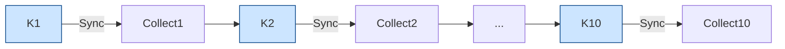

> Even with async pipelining (overlapping Collect + Kernel): N-1 sequential collect operations cannot be parallelized.

### Drop 2: Performance Degradation at 100M+ Items

#### Root Causes: Memory Hierarchy and System Limits

The second performance drop at very large problem sizes (100M+ options) is caused by multiple compounding factors:

#### 1. GPU L2 Cache Thrashing

GPU L2 Cache Size: 4–8 MB (Apple Silicon), 4–72 MB (discrete GPUs)

| Problem Size | Working Set Size | L2 Cache Status |
|-------------|-----------------|-----------------|
| 1M options | 28 MB | Partial fit, good reuse |
| 5M options | 140 MB | Thrashing begins |
| 10M options | 280 MB | Severe thrashing |
| 100M options | 2.8 GB | Complete thrashing (70–700× cache size) |
| 1B options | 28 GB | Continuous cache misses |

> **Impact:** Every memory access becomes a cache miss at large sizes. Full global memory latency (~500 cycles) for all accesses.

#### 2. Memory Bandwidth Saturation

The Black-Scholes kernel requires significant memory bandwidth:

**Memory Traffic per Option:** Input: 5 × f32 = 20 bytes READ | Output: 2 × f32 = 8 bytes WRITE | Total: 28 bytes/option

| Problem Size | Data Volume | @ 50M opts/s | Required Bandwidth |
|-------------|-------------|-------------|-------------------|
| 10M options | 280 MB | 5 sec/batch | 1.4 GB/s (well within limits) |
| 100M options | 2.8 GB | 2 sec | 1.4 GB/s (sustained pressure) |
| 1B options | 28 GB | 20 sec | 1.4 GB/s + memory controller stress |

> While 1.4 GB/s seems low compared to theoretical bandwidth (100–400 GB/s), the actual bottleneck is the streaming/batching overhead, not raw bandwidth.

#### 3. Thermal Throttling (Long-Running Workloads)

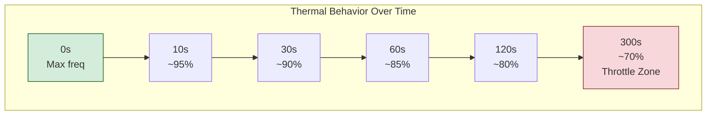

> **Small problems:** Complete before throttling kicks in.
> **Large problems (100M+):** Run long enough to hit thermal limits. First batches are faster than later batches.

#### 4. Unified Memory Contention (Apple Silicon Specific)

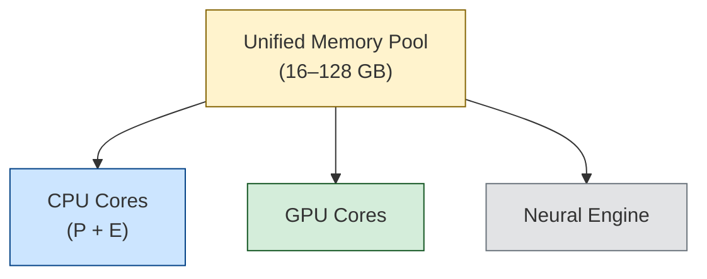

> **Advantage:** No PCIe transfer needed (data already in shared memory).
> **Disadvantage:** All processors compete for same memory bandwidth. At large problem sizes: CPU threads compete with GPU for memory, memory controller becomes bottleneck, TLB pressure increases, page table walks become more frequent.

### Why CPU Parallel Outperforms GPU on Apple Silicon

The benchmark results show CPU Parallel winning at **all problem sizes** on Apple M-series chips. This is a significant finding that deserves explanation:

#### Architectural Advantages of CPU Parallel on Apple Silicon

| Factor | CPU Parallel | GPU via WGPU |
|--------|--------------|--------------|
| **Memory Access** | Direct, no buffer copy | Requires buffer allocation + copy |
| **Data Format** | Native AoS (Array of Structures) | Must convert to SoA for coalescing |
| **Parallelism** | 12 powerful cores, SMT | Many simple cores, but streaming overhead |
| **Cache Efficiency** | Large L1/L2 per core | Shared L2, smaller per-thread |
| **Latency** | Immediate execution | Batch + launch + sync overhead |
| **Memory Bandwidth** | Full unified memory (~400 GB/s) | Same bandwidth, but format conversion |

#### The Streaming/Batching Overhead Problem

**CPU Parallel Execution:**

```mermaid
flowchart LR
    subgraph CPU_PAR["CPU Parallel — Direct processing, no batching"]
        direction TB
        CT0["Thread 0: item 0 → item 12 → item 24 → ..."]
        CT1["Thread 1: item 1 → item 13 → item 25 → ..."]
        CT11["Thread 11: item 11 → item 23 → item 35 → ..."]
    end
    style CPU_PAR fill:#d4edda,stroke:#155724
```

**GPU Streaming Execution:**

```mermaid
flowchart LR
    A["Collect items\ninto batch"] --> B["Convert\nAoS → SoA"] --> C["Allocate\nGPU buffers"] --> D["Copy to\nGPU"] --> E["Launch\nkernel"] --> F["Wait for\ncompletion"] --> G["Copy results\nback"] --> H["Convert\nSoA → AoS"] --> I["Emit\nresults"]

    style A fill:#fff3cd,stroke:#856404
    style E fill:#cce5ff,stroke:#004085
    style I fill:#d4edda,stroke:#155724
```

> Many steps, each with overhead; amortized over batch but never zero.

#### When GPU Would Win

The GPU would outperform CPU Parallel in scenarios with:

1. **Higher Arithmetic Intensity**: More computation per byte of memory accessed
2. **Discrete GPU with Dedicated VRAM**: Avoids unified memory contention
3. **Native GPU Data Format**: Data already in SoA format, no conversion needed
4. **Longer Kernel Execution**: Computation time >> transfer time

For Black-Scholes specifically:
- Arithmetic intensity: ~40 FLOPs / 28 bytes ≈ 1.4 FLOPs/byte (relatively low)
- This makes it **memory-bound**, where CPU's cache hierarchy excel

### Performance Optimization Recommendations

Based on this analysis, here are recommendations for maximizing GPU performance:

#### 1. Dynamic Batch Sizing

```rust
// Adapt batch size to problem size for optimal performance
let batch_size = match num_options {
    n if n <= 1_000_000 => n,           // Single batch for small problems
    n if n <= 10_000_000 => 1_000_000,  // 1M batches for medium problems
    _ => 5_000_000,                      // 5M batches for large problems
};
```

#### 2. Vectorization Tuning

```rust
// Higher vectorization reduces thread count and improves coalescing
let vectorization = match gpu_architecture {
    AppleSilicon => 4,   // Apple GPUs prefer lower vectorization
    NvidiaAmpere => 16,  // NVIDIA benefits from higher vectorization
    _ => 8,              // Conservative default
};
```

#### 3. Workload Suitability Assessment

| Workload Characteristic | GPU Suitability | Recommendation |
|------------------------|-----------------|----------------|
| Arithmetic Intensity < 2 FLOPs/byte | Low | Use CPU Parallel |
| Arithmetic Intensity 2-10 FLOPs/byte | Medium | Benchmark both |
| Arithmetic Intensity > 10 FLOPs/byte | High | Use GPU |
| Problem size < 100K | Low | Use CPU |
| Problem size 100K - 10M | Medium | Benchmark both |
| Problem size > 10M | Variable | Depends on batch efficiency |

---

## Why Speedup Drops After 250M Options (Large Problem Sizes)

In non-streaming mode benchmarks, you may observe that GPU speedup decreases after approximately **250 million options**. This is a well-understood phenomenon caused by several interrelated factors.

### Memory Size Analysis

The Black-Scholes benchmark requires significant memory for large problem sizes:

| Problem Size | Input Data | Output Data | Total Memory |
|--------------|-----------|-------------|--------------|
| 10M options | 200 MB | 80 MB | **280 MB** |
| 100M options | 2 GB | 0.8 GB | **2.8 GB** |
| 250M options | 5 GB | 2 GB | **7 GB** |
| 500M options | 10 GB | 4 GB | **14 GB** |
| 750M options | 15 GB | 6 GB | **21 GB** |
| 1B options | 20 GB | 8 GB | **28 GB** |

**Calculation:**
- Input: 5 f32 fields × 4 bytes × N = 20 bytes/option
- Output: 2 f32 fields × 4 bytes × N = 8 bytes/option
- Total: **28 bytes per option**

### Root Causes of Speedup Drop

#### 1. Memory Bandwidth Saturation

GPUs have finite memory bandwidth. For Black-Scholes:

```
Memory traffic per option = 28 bytes (read) + 8 bytes (write) = 36 bytes

For 250M options at 75M options/sec:
  Bandwidth = 250M × 36 bytes ÷ (250M ÷ 75M sec)
            = 2.7 GB/sec sustained read/write
```

At 250M+ options, the memory controller approaches saturation, causing:
- Increased latency for memory transactions
- Cache thrashing
- Memory bus contention

#### 2. Unified Memory Pressure (Apple Silicon)

On Apple M-series chips, CPU and GPU **share the same memory**:

```mermaid
flowchart LR
    subgraph UM["Unified Memory (16–128 GB)"]
        CPU_C2["CPU Cores\n(P+E)"] <-->|"Contention"| MC["Memory\nController"]
        MC <-->|"Contention"| GPU_C2["GPU Cores\n(Apple GPU)"]
    end

    style UM fill:#fff3cd,stroke:#856404
```

With very large allocations:
- **Page table pressure**: OS must manage millions of memory pages
- **TLB misses**: Translation Lookaside Buffer overflow causes slowdown
- **Memory compaction**: System may need to defragment memory
- **CPU/GPU contention**: Both compete for the same memory bus

#### 3. Discrete GPU Memory Limits (NVIDIA/AMD)

On discrete GPUs with dedicated VRAM:

| GPU | VRAM | Max Single-Batch Size |
|-----|------|----------------------|
| RTX 3060 | 12 GB | ~430M options |
| RTX 3080 | 10 GB | ~357M options |
| RTX 4090 | 24 GB | ~857M options |
| A100 | 40/80 GB | ~1.4B/2.8B options |

When data exceeds VRAM:
- **PCIe transfers**: Data must stream from system RAM (10-20x slower)
- **Memory eviction**: GPU must evict and reload data segments
- **Driver overhead**: Complex memory management adds latency

#### 4. Data Preparation Overhead

For very large batches, CPU-side data preparation becomes significant:

```rust
// For 500M options, this creates 2.5GB of data:
let mut pad_stocks = Vec::with_capacity(num_elements_padded);
for input in inputs {
    pad_stocks.push(input.stock_price);  // 500M iterations
}
```

At 500M options:
- **Allocation time**: ~100-500ms for multi-GB vectors
- **Cache pollution**: Large allocations evict useful cache lines
- **Memory fragmentation**: Repeated large allocs may fail to find contiguous blocks

### Observed Performance Curve

```
Speedup
  ▲
  │     ┌──────────────────┐
  │    /                    \
  │   /                      \
  │  / Peak: 10M-250M         \
  │ /                          \  Decline: 250M+
  │/                            \
  ├─────────────────────────────────────────────→ Problem Size
  │
    ↑                        ↑
    GPU starts               Memory pressure
    winning (10K)            begins
```

### How to Improve Performance for Very Large Problem Sizes

#### 1. Process in Multiple Batches (Chunking)

Instead of one giant batch, split into optimal-sized chunks:

```rust
const OPTIMAL_BATCH_SIZE: usize = 100_000_000; // 100M options

fn process_large_batch(options: &[BlackScholesInput]) -> Vec<BlackScholesOutput> {
    let ctx = GpuContext::new();
    let kernel = BlackScholesKernel::default();
    
    options
        .chunks(OPTIMAL_BATCH_SIZE)
        .flat_map(|chunk| kernel.execute(&ctx, chunk))
        .collect()
}
```

**Benefits:**
- Each chunk fits comfortably in GPU memory
- Better cache utilization
- Allows overlapping compute and transfer (pipelining)

#### 2. Use Streaming with Adaptive Batching

For very large inputs, use Renoir's streaming mode:

```rust
use renoir::operator::gpu::GpuBatchStrategy;

// Let Adaptive strategy find the optimal batch size
let strategy = GpuBatchStrategy::adaptive(10_000_000, 500_000_000);

env.stream_iter(large_options_iterator)
    .map_gpu_with_strategy(BlackScholesKernel::default(), strategy)
    .collect_vec();
```

#### 3. Pipeline CPU and GPU Work

The benchmarks use pipelined processing for datasets larger than 50M options.
This approach splits large batches into chunks and processes them sequentially,
reducing memory pressure and allowing better GPU utilization.

**How Pipelining Works:**

For datasets > 50M options (e.g., 150M options split into 3 chunks):

```mermaid
flowchart TB
    subgraph Pipeline["Pipelined GPU Processing"]
        direction TB
        INPUT["Input Data (150M options)"]

        INPUT --> C1["Chunk 1\n(50M opts)"]
        INPUT --> C2["Chunk 2\n(50M opts)"]
        INPUT --> C3["Chunk 3\n(50M opts)"]

        C1 --> K1["GPU Kernel\nExecution\n(~1.4 GB)"]
        C2 --> K2["GPU Kernel\nExecution\n(~1.4 GB)"]
        C3 --> K3["GPU Kernel\nExecution\n(~1.4 GB)"]

        K1 --> R1["Results 1\n(50M outputs)"]
        K2 --> R2["Results 2\n(50M outputs)"]
        K3 --> R3["Results 3\n(50M outputs)"]

        R1 --> COMBINED["Combined Results\n(150M outputs)"]
        R2 --> COMBINED
        R3 --> COMBINED
    end

    style Pipeline fill:#f9f9f9,stroke:#333
```

**Timeline comparison:**

```mermaid
gantt
    title Pipelined vs Single Batch Processing
    dateFormat X
    axisFormat %s

    section Pipelined (~1.5s)
    Chunk 1 GPU Exec (~0.5s) :a1, 0, 500
    Chunk 2 GPU Exec (~0.5s) :a2, 500, 1000
    Chunk 3 GPU Exec (~0.5s) :a3, 1000, 1500

    section Single Batch
    150M options - HIGH MEMORY PRESSURE (~2.0s+) :crit, b1, 0, 2000
```

**Usage Example:**

```rust
use black_scholes_kernel::{process_pipelined, PIPELINE_CHUNK_SIZE};

// Process large datasets in 50M chunks
let (results, pipeline_info) = process_pipelined(
    &gpu_ctx,
    &kernel,
    &options,
    PIPELINE_CHUNK_SIZE, // 50M options per chunk
);

println!("Processed {} items in {} chunks", 
    pipeline_info.items_processed,
    pipeline_info.chunks_processed);
println!("Total time: {:.3}s, Kernel time: {:.3}s",
    pipeline_info.total_time_s,
    pipeline_info.kernel_time_s);
```

**Benefits:**
- Each chunk fits comfortably in GPU memory (~1.4GB per 50M options)
- Reduced memory pressure for very large datasets
- Better cache utilization
- More consistent performance across different hardware configurations

**For SoA data (optimized benchmarks):**

```rust
use black_scholes_kernel::{process_pipelined_soa, PIPELINE_CHUNK_SIZE};

let (calls, puts, pipeline_info, gpu_threads) = process_pipelined_soa(
    &gpu_ctx,
    &soa_data,
    num_options,
    PIPELINE_CHUNK_SIZE,
);
```

#### 4. Reduce Memory Footprint

**Use Structure-of-Arrays (SoA) instead of Array-of-Structures (AoS):**

```rust
// AoS (current): 20 bytes per option, scattered access
struct BlackScholesInput {
    stock_price: f32,    // 4 bytes
    strike_price: f32,   // 4 bytes
    time_to_expiry: f32, // 4 bytes
    risk_free_rate: f32, // 4 bytes
    volatility: f32,     // 4 bytes
}

// SoA (optimized): Same total memory, but coalesced access
struct BlackScholesInputSoA {
    stock_prices: Vec<f32>,
    strike_prices: Vec<f32>,
    time_to_expirations: Vec<f32>,
    risk_free_rates: Vec<f32>,
    volatilises: Vec<f32>,
}
```

**Benefits:**
- Better memory coalescing on GPU
- Reduced data conversion overhead
- Can skip uploading constant fields (rate, volatility often constant)

#### 5. Compress Constant Fields

If all options share the same `risk_free_rate` and `volatility`:

```rust
// Instead of uploading 250M × 2 × 4 = 2GB of constant data:
// risk_free_rates: [0.05, 0.05, 0.05, ...] × 250M
// volatilises:    [0.20, 0.20, 0.20, ...] × 250M

// Use uniform/constant memory (upload just 8 bytes):
#[cube(launch_unchecked)]
fn black_scholes_optimized<F: Float>(
    stock_prices: &Array<Line<F>>,
    strike_prices: &Array<Line<F>>,
    time_to_expirations: &Array<Line<F>>,
    risk_free_rate: F,    // Single uniform value
    volatility: F,        // Single uniform value
    call_results: &mut Array<Line<F>>,
    put_results: &mut Array<Line<F>>,
) { /* ... */ }
```

**Memory savings:** 40% reduction (from 28 to 16 bytes/option)

#### 6. Use Asynchronous Transfers (Advanced)

With CUDA or advanced WGPU patterns:

```
Timeline with async transfers:
─────────────────────────────────────────────────────────→ Time

CPU:   [Prepare Batch 1][Prepare Batch 2][Prepare Batch 3]
       ↓               ↓               ↓
GPU:        [Transfer 1][Compute 1][Transfer 2][Compute 2]...
                                   ↑           ↑
                              Overlapped with CPU prep
```

### Recommended Batch Sizes by System

| System Type | Recommended Max Batch | Reasoning |
|------------|----------------------|-----------|
| Apple M1 (8GB) | 50-100M | Unified memory constraint |
| Apple M1 Pro/Max (16-32GB) | 100-200M | Better memory bandwidth |
| Apple M2/M3 Ultra (64-128GB) | 200-400M | High bandwidth unified |
| RTX 3060 (12GB VRAM) | 100M | VRAM limit |
| RTX 4090 (24GB VRAM) | 200-300M | VRAM limit |
| A100 (80GB HBM) | 500M-1B | High bandwidth HBM |

### Summary: Optimal Performance Strategy

```
Problem Size               Strategy
─────────────────────────────────────────────────────────
< 10,000             Use CPU (`map`)
10,000 - 75,000      Use GPU (`map_gpu`)
> 75,000             Use GPU (`map_gpu`) with large batch size
─────────────────────────────────────────────────────────
```

**Key takeaway:** For maximum GPU performance, keep individual batch sizes in the **10M to 250M range**. For larger problems, use multiple batches or streaming with Adaptive batching.

---

## Project Structure

The GPU acceleration module is organized into several directories for maintainability and code reuse.

### Directory Layout

The following structure shows the GPU-related files within the broader project:

```
.
├── benches
│   ├── batch_mode.rs
│   ├── caching.rs
│   ├── collatz.rs
│   ├── common.rs
│   ├── connected.rs
│   ├── fold_vs_reduce.rs
│   ├── gpu                            # GPU benchmarks
│   │   ├── black_scholes.rs           # Black-Scholes CPU vs GPU benchmark
│   │   ├── common.rs                  # Shared utilities
│   │   ├── mod.rs                     # Module exports
│   │   ├── monte_carlo.rs             # Monte Carlo CPU vs GPU benchmark
│   │   └── reduce.rs                  # Reduce operator CPU vs GPU benchmark
│   ├── kafka.rs
│   ├── nexmark.rs
│   ├── shuffle.rs
│   ├── tools
│   │   ├── plot_black_scholes.py       # Black-Scholes plotting tool
│   │   ├── plot_monte_carlo.py        # Monte Carlo plotting tool
│   │   ├── plot_monte_carlo_paths.py  # Monte Carlo result plotting
│   │   └── plot_reduce_benchmark.py   # Reduce operator plotting tool
│   └── wordcount.rs
├── examples
│   ├── kernels                        # Reusable GPU kernels
│   │   ├── black_scholes.rs           # Black-Scholes kernel implementation
│   │   ├── mod.rs                     # Kernel module exports
│   │   ├── monte_carlo.rs             # Monte Carlo kernel implementation
│   │   └── tests                      # Kernel unit tests
│   │       ├── black_scholes_tests.rs
│   │       ├── mod.rs
│   │       └── monte_carlo_tests.rs
│   ├── monte_carlo_comparison.rs      # Monte Carlo GPU vs CPU comparison example
│   └── ...                            # Other examples (wordcount, pagerank, etc.)
├── src
│   ├── operator
│   │   ├── gpu                        # GPU operator implementation
│   │   │   ├── batch_strategy.rs      # Batching strategies
│   │   │   ├── context.rs             # GpuContext wrapper
│   │   │   ├── kernel.rs              # GpuKernel trait definition
│   │   │   ├── map_gpu.rs             # MapGpu operator
│   │   │   └── mod.rs                 # Module exports
│   │   ├── reduce_gpu.rs             # ReduceGpu operator (CubeCL reduce)
│   │   └── ...                        # Other operators
│   └── ...                            # Core library files
└── tests
    ├── gpu_kernels.rs                 # GPU kernel integration tests
    └── ...                            # Other integration tests
```

### Key Components

#### GPU Kernels (`examples/kernels/`)

Reusable GPU kernel implementations that can be shared between examples and benchmarks:

```rust
// examples/kernels/mod.rs
pub mod black_scholes;
pub use black_scholes::*;

// examples/kernels/black_scholes.rs
// Contains:
// - BlackScholesInput / BlackScholesOutput structs
// - BlackScholesKernel implementing GpuKernel trait
// - CPU reference implementation (black_scholes_cpu)
// - Data generation utilities (generate_options)
// - Validation utilities (validate_results)
// - Benchmark-specific structures (BenchmarkResult, BenchmarkReport)
```

**Usage in examples:**
```rust
// examples/black_scholes_gpu.rs
#[path = "kernels/black_scholes.rs"]
mod black_scholes_kernel;
use black_scholes_kernel::*;
```

**Usage in benchmarks:**
```rust
// benches/gpu/black_scholes.rs
mod common;  // Shared utilities in same directory
use common::{format_number, get_benchmark_filepath, BenchmarkType, ...};

#[path = "../../examples/kernels/mod.rs"]
mod kernels;
use kernels::black_scholes::{BlackScholesKernel, black_scholes_cpu, ...};
```

#### Benchmarks (`benches/gpu/`)

All GPU benchmarks are unified in a single directory with shared utilities:

| Benchmark | File | Description |
|-----------|------|-------------|
| Black-Scholes | `black_scholes.rs` | CPU Sequential/Parallel vs GPU for option pricing |
| Monte Carlo | `monte_carlo.rs` | CPU Sequential/Parallel vs GPU for path-dependent simulation |
| Reduce | `reduce.rs` | CPU Sequential/Parallel vs GPU for Sum, Product, Min, Max reductions |
| Common | `common.rs` | Shared utilities: test sizes, formatting, JSON output, SystemConfig |

#### Utilities (`src/utils/`)

Console output utilities for formatted banners and tables:

```rust
use renoir::utils::{create_banner, TableBuilder};

// Create a banner with title and content lines
print!("{}", create_banner("BENCHMARK RESULTS", &[
    &format!("Total tests: {}", count),
    &format!("GPU wins: {}", wins),
]));

// Create a formatted table
let table = TableBuilder::new(&[
    ("Test", 8),
    ("Options", 15),
    ("Time", 12),
]);
print!("{}", table.header());
print!("{}", table.row(&["1", "100000", "0.042s"]));
print!("{}", table.footer());
```

### Running Examples

```bash
# Black-Scholes GPU example
cargo run --example black_scholes_gpu --features gpu-wgpu --release

# GPU batching strategies comparison
cargo run --example gpu_batching_strategies --features gpu-wgpu --release
```

### Running Benchmarks

```bash
# Standard CPU vs GPU benchmark
cargo bench --bench gpu_black_scholes_standard --features gpu-wgpu

# Streaming simulation benchmark
cargo bench --bench gpu_black_scholes_streaming --features gpu-wgpu

# Optimized (kernel-only timing) benchmark
cargo bench --bench gpu_black_scholes_optimized --features gpu-wgpu

# Batching strategy comparison
cargo bench --bench gpu_black_scholes_batching_comparison --features gpu-wgpu
```

### Environment Variables for Benchmarks

| Variable | Description | Default |
|----------|-------------|---------|
| `MAX_OPTIONS` | Maximum problem size to benchmark | `10_000_000` |
| `CPU_WORKERS` | Number of CPU workers for parallel tests | `4` |

Example:
```bash
MAX_OPTIONS=100000000 cargo bench --bench gpu_black_scholes_standard --features gpu-wgpu
```

---

## Batching Strategies

The `map_gpu` operator supports three batching strategies:

1. **Fixed**: Flush every N items (default: 10M)
2. **Timed**: Flush on timeout or max size
3. **Adaptive**: Adapt batch size based on throughput

### Fixed Batching Strategy

Flushes the GPU buffer every N items. This is the simplest strategy and works well when the input rate is steady and known.

**Pros**:
- Simple to implement
- Predictable memory usage

**Cons**:
- May underutilize GPU if N is too small
- Can cause latency spikes if N is too large

**Usage**:
```rust
let strategy = GpuBatchStrategy::fixed(10_000_000); // Flush every 10M items
```

### Timed Batching Strategy

Flushes the GPU buffer based on a time interval or when the buffer reaches a maximum size. This strategy is useful for streaming data where the input rate may vary.

**Pros**:
- More responsive to changing input rates
- Can help maintain steady GPU utilization

**Cons**:
- Slightly more complex to implement
- Requires tuning of time and size parameters

**Usage**:
```rust
let strategy = GpuBatchStrategy::timed(max_size, Duration::from_millis(100)); // Flush on timeout or max size
```

### Adaptive Batching Strategy

Dynamically adjusts the batch size based on the current throughput. This strategy provides the best performance in most cases but is also the most complex to implement.

**Pros**:
- Optimal GPU utilization
- Automatically adapts to workload changes

**Cons**:
- Complex to implement
- Higher memory usage during spikes

**Usage**:
```rust
let strategy = GpuBatchStrategy::adaptive(10_000_000, 500_000_000); // Min 10M, max 500M
```

---

## GPU Context and Backend Selection

The `GpuContext` struct provides methods for GPU memory management and synchronization. It abstracts away the details of the underlying GPU backend (WGPU or CUDA).

### Key Methods

- `new()`: Create a new GPU context
- `client()`: Get the compute client for kernel launches
- `sync()`: Wait for GPU operations to complete
- `create_buffer(data: &[u8])`: Create a buffer with data
- `create_empty_buffer(size: usize)`: Create an empty buffer
- `read_buffer(handle: Handle)`: Read buffer data

### Backend Selection

The GPU backend is selected at compile time based on the feature flags:

- `gpu-wgpu`: Enables the WGPU backend (default)
- `gpu-cuda`: Enables the CUDA backend

To switch backends, update your `Cargo.toml`:

```toml
[features]
default = ["gpu-wgpu"]
gpu-wgpu = []
gpu-cuda = []
```

---

## Quick Start Guide

### Step 1: Add Dependencies

```toml
[dependencies]
renoir = { version = "0.6", features = ["gpu-wgpu"] }
bytemuck = { version = "1.12", features = ["derive"] }
serde = { version = "1.0", features = ["derive"] }
cubecl = { version = "0.8" }
```

### Step 2: Define Input/Output Types

```rust
use bytemuck::{Pod, Zeroable};
use serde::{Serialize, Deserialize};

#[derive(Clone, Copy, Pod, Zeroable, Serialize, Deserialize)]
#[repr(C)]
pub struct InputData {
    pub value: f32,
}

#[derive(Clone, Copy, Pod, Zeroable, Serialize, Deserialize)]
#[repr(C)]
pub struct OutputData {
    pub result: f32,
}
```

### Step 3: Implement GpuKernel

```rust
use renoir::operator::gpu::{GpuKernel, GpuContext};

#[derive(Clone, Default)]
struct MyKernel;

impl GpuKernel for MyKernel {
    type Input = InputData;
    type Output = OutputData;

    fn execute(&self, ctx: &GpuContext, inputs: &[InputData]) -> Vec<OutputData> {
        // Your GPU processing logic here
        // See examples/black_scholes_gpu.rs for a complete example
        todo!()
    }
}
```

### Step 4: Use in a Pipeline

```rust
use renoir::prelude::*;
use renoir::operator::gpu::GpuBatchStrategy;

fn main() {
    let env = StreamContext::new_local();
    
    let data: Vec<InputData> = generate_data();
    
    let result = env
        .stream_iter(data.into_iter())
        .map_gpu(MyKernel::default())  // Default batching (10M items)
        // Or with custom strategy for maximum throughput:
        // .map_gpu_with_strategy(MyKernel::default(), GpuBatchStrategy::fixed(data.len()))
        .collect_vec();
    
    env.execute_blocking();
    
    let outputs = result.get().unwrap();
    println!("Processed {} items on GPU", outputs.len());
}
```

---

## Running the Examples

The examples demonstrate different GPU processing patterns, from simple Renoir streaming to advanced double-buffered pipelines.

### Selecting a GPU Backend

All examples support multiple GPU backends. Choose based on your hardware:

```bash
# WGPU backend (recommended for most users)
# Works on: AMD, NVIDIA, Intel, Apple Silicon
cargo run --example <example_name> --release --features gpu-wgpu

# CUDA backend (NVIDIA only)
# Requires: CUDA toolkit installed
cargo run --example <example_name> --release --features gpu-cuda
```

> [!NOTE]
> The `gpu-wgpu` backend uses Vulkan on Linux/Windows and Metal on macOS, automatically selecting the best native API for your GPU.

### Example 1: Black-Scholes GPU (Renoir Streaming)

Demonstrates the `map_gpu` operator with Renoir's streaming API:

```bash
# Build and run the example
cargo run --example black_scholes_gpu --release --features gpu-wgpu
```

**What it demonstrates:**
- Using `map_gpu_with_strategy` with different batch sizes
- Streaming vs full-batch processing comparison
- GPU result validation against CPU reference

### Example 2: GPU Streaming with Batch Strategies

Demonstrates how batch size affects GPU performance using Renoir's `map_gpu_with_strategy`:

```bash
# Default: 10M options
cargo run --example black_scholes_gpu_streaming --release --features gpu-wgpu

# Custom total options
TOTAL_OPTIONS=100000000 cargo run --example black_scholes_gpu_streaming --release --features gpu-wgpu
```

**What it demonstrates:**
- **CPU Sequential**: Single-threaded baseline using Renoir's `map` operator
- **GPU Small Batch (100K)**: Suboptimal batch size with high overhead
- **GPU Optimal Batch (10M)**: Best throughput with good GPU utilization
- **GPU Full Batch**: Single kernel launch for entire dataset

**Key Insights:**
- Small batches (<100K): High kernel launch overhead, poor GPU utilization
- Optimal batches (10M): Best balance of throughput and memory safety
- Full batch: Good for small datasets, risky for large ones (memory cliff at >50M)

### Example 3: GPU Batching Strategies

Demonstrates different batching approaches:

```bash
cargo run --example gpu_batching_strategies --release --features gpu-wgpu
```

**What it demonstrates:**
- Fixed batch size strategy
- Adaptive batch sizing based on throughput
- Impact of batch size on GPU utilization

### What the Examples Do

1. Generate random option parameters (stock price, strike, time, rate, volatility)
2. Process options using GPU kernels with various strategies
3. Validate GPU results against CPU implementation
4. Report timing, throughput, and speedup metrics

---

## Running Benchmarks

Three GPU benchmarks are available, each comparing CPU Sequential, CPU Parallel (Renoir), and GPU strategies.

### Selecting a Backend

```bash
# WGPU backend - works on AMD, NVIDIA, Intel, Apple
cargo bench --bench gpu_black_scholes --features gpu-wgpu
cargo bench --bench gpu_monte_carlo --features gpu-wgpu
cargo bench --bench gpu_reduce --features gpu-wgpu

# CUDA backend - NVIDIA only, requires CUDA toolkit
cargo bench --bench gpu_black_scholes --features gpu-cuda
cargo bench --bench gpu_monte_carlo --features gpu-cuda
cargo bench --bench gpu_reduce --features gpu-cuda
```

> [!TIP]
> On systems with **AMD GPUs**, use `--features gpu-wgpu` which will automatically use Vulkan.
> On systems with **NVIDIA GPUs**, you can use either backend, but `gpu-cuda` may offer slightly better performance.

### Running Individual Benchmarks

```bash
# Black-Scholes (map_gpu - element-wise pricing)
cargo bench --bench gpu_black_scholes --features gpu-wgpu

# Monte Carlo (map_gpu - path-dependent simulation)
cargo bench --bench gpu_monte_carlo --features gpu-wgpu

# Reduce (reduce_gpu - Sum, Product, Min, Max)
cargo bench --bench gpu_reduce --features gpu-wgpu

# Custom max problem size
MAX_OPTIONS=100000000 cargo bench --bench gpu_black_scholes --features gpu-wgpu
```

### Environment Variables

| Variable | Description | Default |
|----------|-------------|---------|
| `MAX_OPTIONS` | Maximum problem size | Benchmark-dependent |

### Benchmark Output

Results are saved to dated directories under `benches/results/`:

```
benches/results/
├── black_scholes/YYYY-MM-DD/
│   ├── black_scholes_benchmark_TIMESTAMP.json
│   └── plot_black_scholes_benchmark_TIMESTAMP.png
├── monte_carlo/YYYY-MM-DD/
│   ├── monte_carlo_benchmark_TIMESTAMP.json
│   └── plot_monte_carlo_benchmark_TIMESTAMP.png
└── reduce/YYYY-MM-DD/
    ├── reduce_benchmark_TIMESTAMP.json
    └── plot_reduce_benchmark_TIMESTAMP.png
```

Each benchmark automatically generates a chart with a standardized metadata footer showing system specs, GPU threads, batch sizes, and test parameters.

---

## Generating Charts

Each benchmark has a dedicated Python plotting script that generates a 2x3 grid of charts with a standardized metadata footer.

### Prerequisites

```bash
pip install matplotlib numpy
```

### Usage

```bash
# Black-Scholes
python3 benches/tools/plot_black_scholes.py black_scholes
python3 benches/tools/plot_black_scholes.py benches/results/black_scholes/YYYY-MM-DD/black_scholes_benchmark_*.json

# Monte Carlo
python3 benches/tools/plot_monte_carlo.py monte_carlo
python3 benches/tools/plot_monte_carlo.py benches/results/monte_carlo/YYYY-MM-DD/monte_carlo_benchmark_*.json

# Reduce
python3 benches/tools/plot_reduce_benchmark.py reduce
python3 benches/tools/plot_reduce_benchmark.py benches/results/reduce/YYYY-MM-DD/reduce_benchmark_*.json
```

### Chart Panels

All three plotters generate a 2x3 grid with these common panels:

| Panel | Content |
|-------|---------|
| **Top-Left** | Execution Time vs Problem Size (log-log) |
| **Top-Center** | GPU Speedup vs Problem Size |
| **Top-Right** | Computational Throughput (GFLOPS) |
| **Bottom row** | Benchmark-specific analysis (throughput, bar charts, distributions) |

### Metadata Footer

Every chart includes a standardized footer with:
`Platform | CPU: cores, RAM | GPU: device | Workers | GPU Threads | Batch | [benchmark-specific] | Sizes | Tests`

---

## Performance Considerations

### GPU Break-Even Point

Based on benchmark results, GPU becomes faster at approximately **75,000 options**.

| Problem Size | Recommended |
|--------------|-------------|
| < 10,000 | Use CPU (`map`) |
| 10,000 - 75,000 | Either (benchmark your use case) |
| > 75,000 | Use GPU (`map_gpu`) |

### Overhead Sources

The Renoir `map_gpu` operator has inherent overhead compared to direct GPU calls:

1. **Streaming model**: Items processed through iterator/queue
2. **Data conversion**: Struct-of-arrays conversion for GPU
3. **Batch emission**: Results emitted one at a time

### Optimization Tips

1. **Use large batch sizes**: Match batch size to problem size when possible
   ```rust
   .map_gpu_with_strategy(kernel, GpuBatchStrategy::fixed(total_items))
   ```

2. **Minimize data transfer**: Keep data on GPU as long as possible

3. **Use vectorization**: Design kernels to use `Line<F>` (4 elements per thread)

4. **Warmup**: First kernel launch compiles shaders; consider warmup runs

### Memory Requirements

Each option requires approximately 28 bytes (5 inputs + 2 outputs × 4 bytes):

| Options | Memory |
|---------|--------|
| 1 million | ~28 MB |
| 10 million | ~280 MB |
| 100 million | ~2.8 GB |
| 1 billion | ~28 GB |

---

## API Reference

### Stream Extension Methods

```rust
impl<Op> Stream<Op> {
    // ── map_gpu ──────────────────────────────────────────────────

    /// Apply GPU kernel with default batching (10M items)
    pub fn map_gpu<K>(self, kernel: K) -> Stream<impl Operator<Out = K::Output>>
    where
        K: GpuKernel<Input = Op::Out>;

    /// Apply GPU kernel with custom batching strategy
    pub fn map_gpu_with_strategy<K>(
        self,
        kernel: K,
        strategy: GpuBatchStrategy,
    ) -> Stream<impl Operator<Out = K::Output>>
    where
        K: GpuKernel<Input = Op::Out>;

    // ── reduce_gpu ───────────────────────────────────────────────

    /// GPU-accelerated reduction with default config
    pub fn reduce_gpu(self, kernel: ReduceKernel) -> Stream<impl Operator<Out = f64>>
    where
        Op::Out: Into<f64>;

    /// GPU-accelerated reduction with custom config
    pub fn reduce_gpu_with(
        self,
        kernel: ReduceKernel,
        config: ReduceGpuConfig,
    ) -> Stream<impl Operator<Out = f64>>
    where
        Op::Out: Into<f64>;
}
```

### ReduceKernel Enum

```rust
pub enum ReduceKernel {
    Sum,      // Identity: 0.0
    Product,  // Identity: 1.0
    Min,      // Identity: +∞
    Max,      // Identity: -∞
}
```

### ReduceGpuConfig Struct

```rust
pub struct ReduceGpuConfig {
    pub batch_size: usize,           // Default: 65,536
    pub backend: ReduceGpuBackend,   // Default: Auto
    pub tile_size: usize,            // Default: 262,144
}

impl ReduceGpuConfig {
    pub fn with_batch_size(self, size: usize) -> Self;
    pub fn with_backend(self, backend: ReduceGpuBackend) -> Self;
    pub fn with_tile_size(self, size: usize) -> Self;
}
```

### GpuKernel Trait

```rust
pub trait GpuKernel: Clone + Send + 'static {
    type Input: Data + bytemuck::Pod;
    type Output: Data + bytemuck::Pod;

    /// Execute kernel on batch (required)
    fn execute(&self, ctx: &GpuContext, inputs: &[Self::Input]) -> Vec<Self::Output>;

    /// Preferred batch size hint (optional)
    fn preferred_batch_size(&self) -> Option<usize> { None }

    /// One-time setup (optional)
    fn setup(&mut self, _ctx: &GpuContext) {}
}
```

### GpuBatchStrategy Enum

```rust
pub enum GpuBatchStrategy {
    /// Flush every N items (default: 10M)
    Fixed(usize),

    /// Flush on timeout or max size
    Timed { max_size: usize, interval: Duration },

    /// Adaptive sizing based on throughput
    Adaptive { min_size: usize, max_size: usize },
}

impl GpuBatchStrategy {
    pub fn fixed(size: usize) -> Self;
    pub fn timed(max_size: usize, interval: Duration) -> Self;
    pub fn adaptive(min_size: usize, max_size: usize) -> Self;
}
```

### GpuContext Struct

```rust
pub struct GpuContext { /* ... */ }

impl GpuContext {
    /// Create new context (initializes GPU)
    pub fn new() -> Self;

    /// Get compute client for kernel launches
    pub fn client(&self) -> &ComputeClient<...>;

    /// Wait for GPU operations to complete
    pub fn sync(&self);

    /// Create buffer with data
    pub fn create_buffer(&self, data: &[u8]) -> Handle;

    /// Create empty buffer
    pub fn create_empty_buffer(&self, size: usize) -> Handle;

    /// Read buffer data
    pub fn read_buffer(&self, handle: Handle) -> Vec<u8>;

    /// Get backend name ("WGPU" or "CUDA")
    pub fn backend_name() -> &'static str;
}
```

---

## Benchmark Results and Analysis

The unified Black-Scholes benchmark compares CPU (sequential and parallel) vs GPU performance using Renoir's streaming operators with async pipelining.

### Dual Timing Measurement Methodology

The benchmark provides **two separate performance measurements** for each execution strategy:

| Measurement | What It Includes | Purpose |
|-------------|-----------------|---------|
| **Compute Only** | Pure computation time without result collection | Measures raw processing speed |
| **Overall (Total)** | Compute + result collection/fetch | Measures real-world end-to-end performance |

**Compute Only Timing:**

```mermaid
flowchart LR
    S1["Stream Processing"] --> C1["Computation"] --> D1["(Discard)"]
    style D1 fill:#e2e3e5,stroke:#6c757d
```

> Measures pure compute performance without I/O overhead. Use case: Compare raw algorithmic efficiency.

**Overall (Total) Timing:**

```mermaid
flowchart LR
    S2["Stream Processing"] --> C2["Computation"] --> COL["Collect Vec"]
    style COL fill:#fff3cd,stroke:#856404
```

> Measures end-to-end performance including result fetch. Use case: Realistic application performance.
>
> For GPU workloads, the difference can be significant: Compute Only excludes GPU→CPU data transfer; Overall includes buffer allocation, synchronization, and result transfer.

**Why This Matters:**

1. **GPU overhead visibility**: The difference between "Compute Only" and "Overall" reveals the GPU pipeline overhead (buffer creation, data transfer, synchronization)

2. **Fair comparison**: Comparing "Compute Only" times shows raw computational throughput, while "Overall" shows practical application performance

3. **Optimization targets**: If "Compute Only" is fast but "Overall" is slow, the bottleneck is in data transfer/collection, not computation

### Latest Benchmark Chart

> Benchmark run: 2026-02-08 | Platform: macOS aarch64 | GPU: Apple M2 Pro (WGPU) | 12 CPU cores, 32 GB RAM

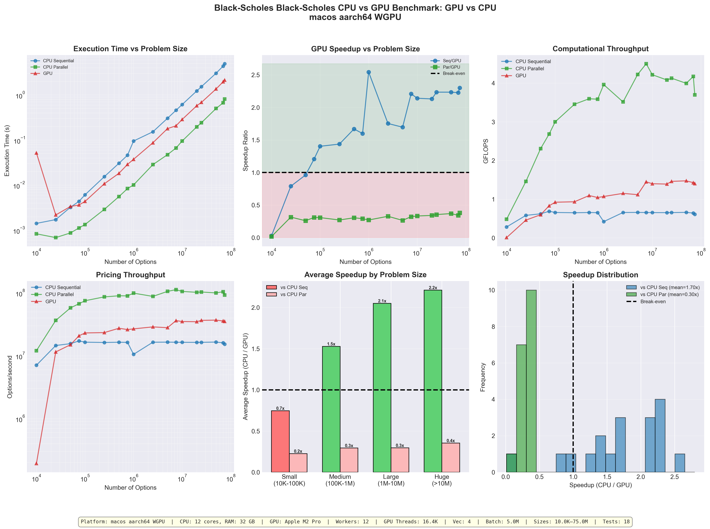

### Performance Summary

| Metric | Value |
|--------|-------|
| **Problem size range** | 10K -- 75M options |
| **Total tests** | 18 |
| **GPU break-even (vs Sequential)** | ~75K options |
| **Best GPU speedup (vs Sequential)** | **2.54x** at 1M options |
| **Mean GPU speedup (vs Sequential)** | 1.70x |
| **GPU vs CPU Parallel** | 0.30x mean (CPU Parallel wins) |
| **GPU wins vs Sequential** | 83.3% of tests (15/18) |
| **GPU wins vs Parallel** | 0% of tests |
| **Peak GPU GFLOPS** | 1.48 |
| **Peak CPU Parallel GFLOPS** | 4.50 |

### Key Insights

1. **GPU excels vs single-threaded CPU**: 2-2.5x speedup for problems >75K options
2. **CPU Parallel is highly competitive**: 12-core Apple M2 Pro outperforms GPU for this workload due to the low arithmetic intensity (~40 FLOPs/option)
3. **Black-Scholes is memory-bound on GPU**: At only 1.4 FLOP/byte, the GPU cannot fully exploit its compute capacity
4. **Streaming overhead is significant**: GPU pipeline overhead (buffering, data transfer) reduces raw kernel performance

### Running the Benchmark

```bash
cargo bench --bench gpu_black_scholes --features gpu-wgpu
MAX_OPTIONS=100000000 cargo bench --bench gpu_black_scholes --features gpu-wgpu
```

---

## The Monte Carlo Model

The **Monte Carlo method** is a stochastic simulation approach for pricing financial derivatives, particularly useful for path-dependent options where no closed-form solution exists [6]. Unlike Black-Scholes which provides an analytical solution, Monte Carlo simulates many possible price paths and averages the payoffs.

### Key Concepts and Terminology

Before diving into the algorithm, let's understand the fundamental concepts:

#### Option Basics

| Term | Symbol | Description |
|------|--------|-------------|
| **Stock Price** | S | Current market price of the underlying asset |
| **Strike Price** | K | The price at which the option holder can buy (call) or sell (put) the stock |
| **Time to Expiry** | T | Time remaining until the option expires (in years) |
| **Risk-free Rate** | r | The theoretical rate of return with zero risk (e.g., Treasury bonds) |
| **Volatility** | σ | A measure of how much the stock price fluctuates (standard deviation) |

#### Strike Price (K)

The **strike price** is the predetermined price at which an option can be exercised:

```mermaid
flowchart LR
    BELOW["Stock at $90\n(call option worthless)"] --- STRIKE["Strike K = $105"]
    STRIKE --- ABOVE["Stock at $120\n(call option valuable)"]

    style BELOW fill:#f8d7da,stroke:#842029
    style STRIKE fill:#fff3cd,stroke:#856404
    style ABOVE fill:#d4edda,stroke:#155724
```

- For a **call option**: The holder has the right to *buy* the stock at price K
- For a **put option**: The holder has the right to *sell* the stock at price K

#### ITM (In-The-Money) vs OTM (Out-of-The-Money)

These terms describe whether an option would be profitable if exercised immediately:

```mermaid
flowchart TB
    ITM["ITM REGION (Call) — Price $130\nStock > Strike = Option has value\nPayoff = $130 − $105 = $25"]
    STRIKE["═══ STRIKE K = $105 ═══"]
    OTM["OTM REGION (Call) — Price $80\nStock < Strike = Option worthless\nPayoff = max($80 − $105, 0) = $0"]

    ITM --- STRIKE --- OTM

    style ITM fill:#d4edda,stroke:#155724
    style STRIKE fill:#fff3cd,stroke:#856404
    style OTM fill:#f8d7da,stroke:#842029
```

| Region | Call Option | Put Option |
|--------|-------------|------------|
| **ITM** (In-The-Money) | Stock > Strike | Stock < Strike |
| **ATM** (At-The-Money) | Stock ≈ Strike | Stock ≈ Strike |
| **OTM** (Out-of-The-Money) | Stock < Strike | Stock > Strike |

#### Option Payoff

The **payoff** is the value of an option at expiration:

```text
Call Option Payoff = max(S_T - K, 0)   "buy low, sell high"
Put Option Payoff  = max(K - S_T, 0)   "sell high, buy low"

Where S_T = stock price at expiration T
```

**Example:**
- Stock price at expiration: S_T = $120
- Strike price: K = $105
- Call payoff = max($120 - $105, 0) = $15 ✓
- Put payoff = max($105 - $120, 0) = $0 (worthless)

#### Why Monte Carlo?

Monte Carlo simulation is used when:

1. **No closed-form solution exists** (path-dependent options, exotic options)
2. **Multiple sources of uncertainty** (multi-factor models)
3. **Complex payoff structures** (barrier options, Asian options)

| Method | When to Use | Compute Cost |
|--------|-------------|--------------|
| Black-Scholes | Simple European options | ~40 FLOPs |
| Monte Carlo | Path-dependent, exotic options | ~1,000,000 FLOPs |
| GPU Monte Carlo | Same, but much faster | Same FLOPs, 100-600x speedup |

#### Monte Carlo Intuition

The idea is simple: simulate many possible futures, calculate what the option would pay in each future, and average the results:

```mermaid
flowchart TB
    SIM["1000 Simulated Futures"]
    SIM --> FUTURES["Future 1: Stock → $120, payoff $15\nFuture 2: Stock → $85, payoff $0\nFuture 3: Stock → $142, payoff $37\nFuture 4: Stock → $91, payoff $0\n...\nFuture 1000: Stock → $108, payoff $3"]
    FUTURES --> AVG["Average payoff = $8.80"]
    AVG --> DISC["Discount to today\n$8.80 × e⁻ʳᵀ"]
    DISC --> PRICE["Option Price ≈ $8.38"]

    style SIM fill:#4a90d9,stroke:#2a5a8a,color:#fff
    style PRICE fill:#28a745,stroke:#1e7e34,color:#fff
```

#### Geometric Brownian Motion (GBM)

Stock prices are modeled using **Geometric Brownian Motion**, which assumes prices follow a random walk with:
- A predictable **trend** (drift)
- **Random fluctuations** (diffusion)

The discrete-time GBM formula for simulating stock price paths:

$$S_{t+\Delta t} = S_t \times \exp\left(\text{drift} + \text{diffusion} \times Z\right)$$

Where Z ~ N(0,1) is a standard normal random variable.

#### Drift Term

The **drift** represents the expected direction of stock price movement:

```text
drift = (r - σ²/2) × Δt
```

| Component | Meaning |
|-----------|---------|
| `r` | Risk-free rate (expected return in risk-neutral world) |
| `σ²/2` | Convexity correction (Jensen's inequality adjustment) |
| `Δt` | Time step size (e.g., 1/50 = 0.02 years) |

**Example:**
- r = 5% (0.05), σ = 20% (0.2), Δt = 0.02
- drift = (0.05 - 0.5 × 0.04) × 0.02 = (0.05 - 0.02) × 0.02 = **0.0006**

This means on average, the stock gains 0.06% per time step (before random fluctuations).

#### Diffusion Term

The **diffusion** represents the magnitude of random price movements:

```text
diffusion = σ × √Δt
```

| Component | Meaning |
|-----------|---------|
| `σ` | Volatility (annual standard deviation of returns) |
| `√Δt` | Time scaling (volatility scales with square root of time) |

**Example:**
- σ = 20% (0.2), Δt = 0.02
- diffusion = 0.2 × √0.02 = 0.2 × 0.1414 = **0.0283**

This scales the random component Z ~ N(0,1) to match the stock's volatility.

#### Complete GBM Update Step

Putting it together for one time step:

```mermaid
flowchart TB
    subgraph GBM["GBM Price Update"]
        direction TB
        FORMULA["S_new = S_old × exp(drift + diffusion × Z)"]
        PARAMS["drift = (r - σ²/2) × Δt = 0.0006\ndiffusion = σ × √Δt = 0.0283\nZ = random normal ~ N(0,1) = -0.65 (example)"]
        CALC["Example: S_old = 100.00\nexponent = 0.0006 + 0.0283 × (−0.65) = −0.0178\nS_new = 100.00 × exp(−0.0178) = 98.23"]
        INTERP["Stock dropped 1.77% this step due to negative Z"]
        FORMULA --> PARAMS --> CALC --> INTERP
    end

    style GBM fill:#f9f9f9,stroke:#333
    style INTERP fill:#fff3cd,stroke:#856404
```

The algorithm simulates stock price paths using Geometric Brownian Motion (GBM):

$$S_{t+\Delta t} = S_t \cdot \exp\left[\left(r - \frac{\sigma^2}{2}\right)\Delta t + \sigma\sqrt{\Delta t} \cdot Z\right]$$

Where:
- $S_t$ = Stock price at time $t$
- $r$ = Risk-free interest rate
- $\sigma$ = Volatility
- $\Delta t$ = Time step
- $Z$ = Standard normal random variable

### Input/Output Structure

```rust
#[derive(Clone, Copy, Pod, Zeroable)]
#[repr(C)]
pub struct MonteCarloInput {
    pub stock_price: f32,       // Current stock price S₀
    pub strike_price: f32,      // Strike price K
    pub time_to_expiry: f32,    // Time to expiration T (years)
    pub risk_free_rate: f32,    // Risk-free rate r
    pub volatility: f32,        // Volatility σ
}

#[derive(Clone, Copy, Pod, Zeroable)]
#[repr(C)]
pub struct MonteCarloOutput {
    pub call_price: f32,        // European call option price
    pub put_price: f32,         // European put option price
}
```

### Algorithm Steps

1. **Initialize**: Set initial stock price $S_0$ and calculate drift/diffusion terms
2. **Simulate Paths**: For each path:
   - Generate random normal variates using Box-Muller transform
   - Apply GBM formula for each time step
   - Calculate terminal stock price $S_T$
3. **Calculate Payoff**: $\max(S_T - K, 0)$ for calls
4. **Discount**: Apply risk-free discount factor $e^{-rT}$
5. **Average**: Mean of all discounted payoffs gives option price

### Computational Complexity

| Parameter | Default Value | Total Operations |
|-----------|---------------|------------------|
| Paths (N) | 1,000 | - |
| Time Steps (M) | 50 | - |
| Ops per step | ~20 | exp, sqrt, multiply |
| **Total FLOPs/option** | **~1,000,000** | N × M × ops |

**Note**: Monte Carlo is significantly more compute-intensive than Black-Scholes (~40 FLOPs), making it an excellent candidate for GPU acceleration.

### GPU Kernel Architecture

The Monte Carlo GPU kernel uses the same SoA (Structure of Arrays) layout as Black-Scholes for optimal memory coalescing:

```mermaid
flowchart LR
    subgraph CPU["CPU Side"]
        INPUT["MonteCarloInput\n- stock_price\n- strike_price\n- time_to_expiry\n- risk_free_rate\n- volatility"]
        OUTPUT["MonteCarloOutput\n- call_price\n- put_price"]
    end

    subgraph GPU["GPU Side"]
        direction TB
        SOA["SoA Buffers\nstocks[] | strikes[] | times[]\nrates[] | vols[] | seeds[]"]
        SOA --> KERNEL["monte_carlo_kernel()\n- xorshift32 RNG\n- Box-Muller transform\n- GBM simulation\n- Payoff calculation"]
        KERNEL --> OUTBUF["Output Buffers\ncall_prices[] | put_prices[]"]
    end

    INPUT -->|"copy to GPU"| SOA
    OUTBUF -->|"read back"| OUTPUT

    style CPU fill:#e8f4e8,stroke:#2d862d
    style GPU fill:#e8eaf4,stroke:#2d4a86
```

### Deterministic Seeding

A key feature of the Monte Carlo implementation is **deterministic seeding** for reproducible results. This ensures that CPU and GPU produce identical outputs for the same inputs, enabling validation.

#### Why Not Use Rust's `std::hash`?

We chose a **custom hash combining algorithm** instead of Rust's standard library `Hash` trait for critical reasons:

| Approach | Portable? | GPU Compatible? | Stable? | Notes |
|----------|-----------|-----------------|---------|-------|
| `std::hash::DefaultHasher` | ❌ | ❌ | ❌ | Uses SipHash with per-process random seed |
| `#[derive(Hash)]` | ❌ | ❌ | ❌ | Same underlying SipHash issues |
| `ahash` / `xxhash` crates | ✅ | ❌ | ⚠️ | External dependency, not GPU-portable |
| **Custom boost-style** | ✅ | ✅ | ✅ | **Our choice** |

**Key requirements our algorithm satisfies:**

1. **GPU Compatibility**: The exact same algorithm must run in CubeCL GPU kernels
2. **Cross-platform Stability**: Same result on all architectures, Rust versions, and GPU backends
3. **No Dependencies**: Pure bitwise math, no external crates needed
4. **Simplicity**: Easy to verify correctness; can be implemented in any language

> **Reference**: The algorithm is based on the [boost::hash_combine](https://www.boost.org/doc/libs/1_83_0/doc/html/hash/combine.html) 
> function from C++ Boost, which has been widely used and tested for over 20 years.

---

#### The Hash Combining Algorithm

The core formula for combining a value into an existing seed:

```
new_seed = old_seed XOR (value + 0x9e3779b9 + (old_seed << 6) + (old_seed >> 2))
```

**The Golden Ratio Constant `0x9e3779b9`:**
- This is `floor(2^32 / φ)` where φ ≈ 1.618034 is the golden ratio
- Binary: `10011110001101110111100110111001`
- **Why it works**: The golden ratio is the "most irrational" number, meaning its continued fraction representation converges slowest. This creates a bit pattern that maximizes mixing without obvious regularities.

---

#### Step-by-Step: From Input to Unique Seed

Let's trace exactly how an input becomes a unique seed:

**Step 1: Extract IEEE 754 Bit Patterns**

Each `f32` parameter is converted to its raw 32-bit representation:

```rust
let stock_bits  = input.stock_price.to_bits();    // 100.0 → 0x42C80000
let strike_bits = input.strike_price.to_bits();   // 105.0 → 0x42D20000
let time_bits   = input.time_to_expiry.to_bits(); // 1.0   → 0x3F800000
let rate_bits   = input.risk_free_rate.to_bits(); // 0.05  → 0x3D4CCCCD
let vol_bits    = input.volatility.to_bits();     // 0.2   → 0x3E4CCCCD
```

**Why `.to_bits()`?** This preserves all information in the float, including:
- Sign bit (1 bit)
- Exponent (8 bits) 
- Mantissa (23 bits)

Two floats that compare equal will have the same bits, ensuring determinism.

**Step 2: Initialize Seed**

```rust
let mut seed = stock_bits;  // seed = 0x42C80000
```

**Step 3: Chain Hash Combining**

For each remaining parameter, apply the combine formula:

```
Iteration 1 (strike_price):
  temp = strike_bits + 0x9e3779b9 + (seed << 6) + (seed >> 2)
       = 0x42D20000 + 0x9e3779b9 + 0x0B200000 + 0x10B20000
       = [32-bit result with wraparound]
  seed = seed XOR temp
       = new mixed value

Iteration 2 (time_to_expiry):
  seed = seed XOR (time_bits + 0x9e3779b9 + (seed << 6) + (seed >> 2))
  
Iteration 3 (risk_free_rate):
  seed = seed XOR (rate_bits + 0x9e3779b9 + (seed << 6) + (seed >> 2))

Iteration 4 (volatility):
  seed = seed XOR (vol_bits + 0x9e3779b9 + (seed << 6) + (seed >> 2))
```

**Step 4: Ensure Non-Zero**

```rust
if seed == 0 { 1 } else { seed }
```

The xorshift RNG has a fixed point at 0 (xorshift(0) = 0), so we must avoid it.

---

#### Complete Implementation

```rust
pub fn deterministic_seed(input: &MonteCarloInput) -> u32 {
    // Step 1: Convert f32 → u32 bit representation
    let stock_bits = input.stock_price.to_bits();
    let strike_bits = input.strike_price.to_bits();
    let time_bits = input.time_to_expiry.to_bits();
    let rate_bits = input.risk_free_rate.to_bits();
    let vol_bits = input.volatility.to_bits();
    
    // Step 2-3: Chain hash combining with golden ratio constant
    let mut seed = stock_bits;
    seed ^= strike_bits.wrapping_add(0x9e3779b9).wrapping_add(seed << 6).wrapping_add(seed >> 2);
    seed ^= time_bits.wrapping_add(0x9e3779b9).wrapping_add(seed << 6).wrapping_add(seed >> 2);
    seed ^= rate_bits.wrapping_add(0x9e3779b9).wrapping_add(seed << 6).wrapping_add(seed >> 2);
    seed ^= vol_bits.wrapping_add(0x9e3779b9).wrapping_add(seed << 6).wrapping_add(seed >> 2);
    
    // Step 4: Ensure non-zero for xorshift RNG
    if seed == 0 { 1 } else { seed }
}
```

---

#### Visualization: Bit Mixing

```
Input: MonteCarloInput { stock: 100.0, strike: 105.0, time: 1.0, rate: 0.05, vol: 0.2 }

                 stock_bits          strike_bits
                 0x42C80000          0x42D20000
                     │                    │
                     ▼                    ▼
              ┌──────────┐         ┌──────────┐
              │  seed₀   │◄────────│  combine │
              │          │    XOR  │  formula │
              └────┬─────┘         └──────────┘
                   │
                   ▼
              ┌──────────┐         time_bits
              │  seed₁   │◄────────0x3F800000
              └────┬─────┘    XOR
                   │
                   ▼
              ┌──────────┐         rate_bits
              │  seed₂   │◄────────0x3D4CCCCD
              └────┬─────┘    XOR
                   │
                   ▼
              ┌──────────┐         vol_bits
              │  seed₃   │◄────────0x3E4CCCCD
              └────┬─────┘    XOR
                   │
                   ▼
              ┌──────────┐
              │  final   │───► unique 32-bit seed
              │   seed   │     for this option
              └──────────┘
```

---

#### Properties Summary

| Property | Description |
|----------|-------------|
| **Deterministic** | Same inputs → same seed (always reproducible) |
| **Unique** | Different inputs → different seeds (with high probability) |
| **Fast** | Only bitwise operations (no division/modulo) |
| **Non-zero** | Returns 1 if result is 0 (xorshift requirement) |
| **Portable** | Same result on CPU and GPU (pure integer math) |
| **GPU-safe** | No branching except final zero-check |

This ensures:
- Same input → same seed → same random sequence → same output
- CPU and GPU produce **identical results** for the same inputs
- Tests can validate GPU correctness against CPU reference

### CPU/GPU Validation

Because both CPU and GPU use identical seeding and RNG algorithms, the benchmark performs **exact validation** of GPU results:

```rust
/// Validate GPU results against CPU results.
///
/// Since both CPU and GPU now use deterministic seeding via `deterministic_seed(&input)`,
/// they produce identical results for the same inputs. We can do exact comparison.
fn validate_results(
    cpu_results: &[MonteCarloOutput],
    gpu_results: &[MonteCarloOutput],
    sample_size: usize,
) -> (bool, f64, f64, usize) {
    const TOLERANCE: f64 = 0.01; // 1% relative error (for f32 precision)
    
    for (cpu, gpu) in cpu_results.iter().zip(gpu_results).take(sample_size) {
        let call_err = (cpu.call_price - gpu.call_price).abs() as f64;
        // Check relative error for non-zero prices
        if cpu.call_price.abs() > 0.01 {
            let rel_err = call_err / cpu.call_price.abs() as f64;
            if rel_err > TOLERANCE { /* validation failed */ }
        }
    }
    // Returns: (passed, max_error, avg_error, sample_count)
}
```

**Validation tolerance**: 1% relative error accounts for floating-point precision differences between CPU (x86 FMA) and GPU (shader intrinsics) implementations of `exp()` and `sqrt()`.

### Random Number Generation: xorshift32 + Box-Muller

Monte Carlo simulation requires high-quality random numbers. Our implementation uses two algorithms working together:

1. **xorshift32**: Generates uniform random numbers in [0, 1)
2. **Box-Muller Transform**: Converts uniform random numbers to normal distribution

Both CPU and GPU use **identical implementations** to ensure reproducible results.

---

#### xorshift32: Fast Uniform Random Number Generator

The xorshift family of PRNGs, introduced by George Marsaglia in 2003, provides excellent speed and quality for Monte Carlo simulation.

**Algorithm:**

```
x ^= x << 13;  // Mix upper bits into lower bits
x ^= x >> 17;  // Mix lower bits into upper bits
x ^= x << 5;   // Final mixing pass
```

**Properties:**

| Property | Value | Notes |
|----------|-------|-------|
| Period | 2³² - 1 | All 32-bit values except 0 |
| Operations | 3 XOR + 3 shifts | Very fast, no division |
| State size | 32 bits | Minimal memory footprint |
| Quality | Good | Passes most statistical tests |

**Implementation (identical on CPU and GPU):**

```rust
// CPU version
fn xorshift_cpu(state: &mut u32) -> f32 {
    let mut x = *state;
    x ^= x << 13;
    x ^= x >> 17;
    x ^= x << 5;
    *state = x;
    
    // Convert to f32 using upper 23 bits
    let bits = x >> 9;
    bits as f32 * 1.1920929e-7
}

// GPU version (CubeCL)
#[cube]
fn xorshift<F: Float>(state: &mut u32) -> F {
    let mut x = *state;
    x ^= x << 13;
    x ^= x >> 17;
    x ^= x << 5;
    *state = x;
    let bits = x >> 9;
    F::cast_from(bits) * F::new(1.1920929e-7)
}
```

**Why `x >> 9` and `1.1920929e-7`?**

The conversion uses the **upper 23 bits** because:

1. xorshift has better randomness in high bits than low bits
2. f32 mantissa is exactly 23 bits
3. Maximizes output precision

```text
32-bit xorshift state:  [xxxxxxxx xxxxxxxx xxxxxxxx xxxxxxxx]
                                  ↓ shift right by 9
Upper 23 bits:          [00000000 0xxxxxxx xxxxxxxx xxxxxxxx]
                                  ↓ multiply by 2^(-23)
f32 in [0, 1):          0.xxxxxxx... (full mantissa utilized)
```

The magic constant `1.1920929e-7 = 2^(-23) = 1/8388608`.

> **Reference**: Marsaglia, G. (2003). "Xorshift RNGs". *Journal of Statistical Software*.
> https://www.jstatsoft.org/article/view/v008i14

---

#### Box-Muller Transform: Uniform to Normal Distribution

Monte Carlo option pricing requires normally-distributed random numbers for stock price paths. The Box-Muller transform converts uniform random numbers to normal distribution.

**The Transform:**

Given two independent uniform random variables U₁, U₂ ∈ (0, 1):

```
Z₁ = √(-2 ln U₁) × cos(2π U₂)
Z₂ = √(-2 ln U₁) × sin(2π U₂)
```

Both Z₁ and Z₂ are independent standard normal N(0, 1) random variables.

**Why It Works (Visual Explanation):**

```mermaid
flowchart LR
    U["Uniform [0,1)²\nU₁, U₂"] -->|"Box-Muller"| P["Polar Coordinates\nr = √(-2 ln U₁)\nθ = 2π U₂"]
    P -->|"projection"| N["Normal Distribution\nZ = r × cos(θ)\n~ N(0,1)"]

    style U fill:#fff3cd,stroke:#856404
    style P fill:#cce5ff,stroke:#004085
    style N fill:#d4edda,stroke:#155724
```

**Mathematical Derivation:**

1. `-2 ln U₁` follows exponential distribution (λ = 2)
2. `√(-2 ln U₁)` is Rayleigh distributed (the radius r)
3. `2π U₂` provides uniform angle θ in [0, 2π)
4. (r, θ) is a point in polar coordinates
5. x = r cos(θ), y = r sin(θ) are independent N(0,1)

**Implementation (identical on CPU and GPU):**

```rust
// CPU version
fn box_muller_cpu(state: &mut u32) -> f32 {
    let u1 = xorshift_cpu(state);
    let u2 = xorshift_cpu(state);
    
    // Prevent ln(0) = -∞
    let u1_safe = u1.max(1e-10);
    
    // Z = √(-2 ln U₁) × cos(2π U₂)
    (-2.0 * u1_safe.ln()).sqrt() * (6.283185 * u2).cos()
}

// GPU version (CubeCL)
#[cube]
fn box_muller<F: Float>(state: &mut u32) -> F {
    let u1: F = xorshift(state);
    let u2: F = xorshift(state);
    let u1_safe = F::max(u1, F::new(1e-10));
    F::sqrt(F::new(-2.0) * F::ln(u1_safe)) * F::cos(F::new(6.283185) * u2)
}
```

**Implementation Notes:**

| Detail | Explanation |
|--------|-------------|
| `u1.max(1e-10)` | Prevents ln(0) = -∞ |
| `6.283185` | = 2π (full circle in radians) |
| Only Z₁ used | Z₂ (sine form) is discarded for simplicity |
| 50% efficiency | Could save Z₂ for next call (not implemented) |

#### Why Basic Box-Muller vs Polar (Marsaglia) Method?

The **Polar Method** (Marsaglia, 1964) is an alternative that avoids expensive `cos()` and `sin()` calls using rejection sampling:

```rust
fn polar_method(state: &mut u32) -> (f32, f32) {
    loop {
        let u = 2.0 * xorshift(state) - 1.0;  // [-1, 1]
        let v = 2.0 * xorshift(state) - 1.0;  // [-1, 1]
        let s = u*u + v*v;
        
        if s < 1.0 && s > 0.0 {  // Accept if inside unit circle
            let m = (-2.0 * s.ln() / s).sqrt();
            return (u * m, v * m);  // Both Z₁ and Z₂
        }
        // Reject (~21% rejection rate) and retry
    }
}
```

**Why we chose Basic Box-Muller instead:**

| Factor | Basic Box-Muller | Polar Method |
|--------|------------------|--------------|
| **GPU branching** | ✅ None | ❌ Rejection loop |
| **Thread divergence** | ✅ All threads same path | ❌ Warps wait for slowest thread |
| **Predictable timing** | ✅ Fixed operations | ❌ Variable iterations |
| **Simplicity** | ✅ Simple | ❌ Complex state management |
| **Compute per call** | 1 ln + 1 sqrt + 1 cos | ~1.27 ln + 1 sqrt (amortized) |

**The Critical Issue: GPU Thread Divergence**

On GPUs, threads in a **warp** (32 threads on NVIDIA, 64 on AMD) must execute the same instruction. If any thread needs to reject and retry, **all threads in the warp must wait**:

```text
Warp of 32 threads executing polar method:
  Thread 0:  Accept (1 iteration)  ─┐
  Thread 1:  Reject → Accept       ─┤
  ...                              ─┼── All wait for Thread 31
  Thread 31: Reject → Reject → OK  ─┘
  
  Result: Warp takes 3 iterations even though most threads needed only 1!
```

**Design Decision Summary:**

| Scenario | Best Choice | Reason |
|----------|-------------|--------|
| CPU-only | Polar method | Saves both Z₁, Z₂; ~20% faster |
| GPU-only | Basic Box-Muller | No branching, no divergence |
| **CPU=GPU parity** (our case) | **Basic Box-Muller** | Same algorithm, identical results |

Since we require **identical results on CPU and GPU** for validation, we use the same algorithm on both platforms. Basic Box-Muller's simplicity and lack of branching makes it the pragmatic choice.

> **Potential Optimization**: Cache Z₂ for the next call requires per-thread state management, which adds complexity without significant benefit for our use case.

> **Reference**: Box, G.E.P.; Muller, M.E. (1958). "A Note on the Generation of Random Normal Deviates".
> *The Annals of Mathematical Statistics*. 29(2): 610–611.

---

#### Complete RNG Pipeline

```mermaid
flowchart LR
    SEED["deterministic_seed()\n→ Unique seed\nfrom input parameters"] --> XOR["xorshift32\nstate ← mixing\n→ Uniform [0,1)\nrandom number\n(reproducible)"]
    XOR --> BM["Box-Muller\nTransform\n→ Normal N(0,1)\nrandom number\n(for stock paths)"]

    style SEED fill:#fff3cd,stroke:#856404
    style XOR fill:#cce5ff,stroke:#004085
    style BM fill:#d4edda,stroke:#155724
```

This pipeline ensures:
- **Determinism**: Same input → same seed → same random sequence → same output
- **GPU/CPU Parity**: Identical algorithms produce identical results
- **Statistical Quality**: Suitable for Monte Carlo simulation

---

## GPU Parallelization Strategy

Monte Carlo option pricing is **embarrassingly parallel** at the option level. Each option can be priced completely independently, making it ideal for GPU acceleration.

### Parallelization Model: One Thread Per Option

```mermaid
flowchart LR
    subgraph PAR["GPU Parallelization — ALL IN PARALLEL"]
        direction TB
        O0["Option 0"] --> T0["Thread 0"] --> W0["1000 paths × 50 steps"] --> P0["Price₀"]
        O1["Option 1"] --> T1["Thread 1"] --> W1["1000 paths × 50 steps"] --> P1["Price₁"]
        O2["Option 2"] --> T2["Thread 2"] --> W2["1000 paths × 50 steps"] --> P2["Price₂"]
        ON["Option N"] --> TN["Thread N"] --> WN["1000 paths × 50 steps"] --> PN["PriceN"]
    end

    style PAR fill:#e8eaf4,stroke:#2d4a86
```

Each GPU thread:
1. Loads one option's parameters
2. Runs all simulation paths (1000) × all time steps (50) = 50,000 iterations
3. Writes the computed call/put price

### GPU Kernel Structure

```rust
#[cube(launch_unchecked)]
fn monte_carlo_kernel<F: Float>(
    stocks: &Array<F>,     // Option parameters (SoA layout)
    strikes: &Array<F>,
    times: &Array<F>,
    rates: &Array<F>,
    vols: &Array<F>,
    seeds: &Array<u32>,    // Deterministic seed per option
    call_out: &mut Array<F>,
    put_out: &mut Array<F>,
    num_paths: u32,        // 1000
    num_steps: u32,        // 50
) {
    // ABSOLUTE_POS = unique thread ID (0, 1, 2, ..., N-1)
    if ABSOLUTE_POS < stocks.len() {
        let mut seed = seeds[ABSOLUTE_POS];  // Each thread has unique seed
        let s0 = stocks[ABSOLUTE_POS];       // Each thread processes one option
        
        let mut sum_payoff = F::new(0.0);
        
        for _ in 0..num_paths {              // 1000 paths (sequential)
            let mut s = s0;
            for _ in 0..num_steps {          // 50 steps (sequential)
                let z = box_muller(&mut seed);
                s *= F::exp(drift + diffusion * z);
            }
            sum_payoff += (s - k).max(0.0);
        }
        
        call_out[ABSOLUTE_POS] = df * sum_payoff / F::cast_from(num_paths);
    }
}
```

### GPU Execution Model

```mermaid
flowchart TB
    subgraph GPU_HW["GPU with 1000s of cores"]
        direction LR
        SM1["SM"] --> W0["Warp 0\n(32 threads)"]
        SM2["SM"] --> W1["Warp 1\n(32 threads)"]
        SM3["SM"] --> W2["Warp 2\n(32 threads)"]
        SM4["SM"] --> W3["Warp 3\n(32 threads)"]
        SMN["SM ..."] --> WN["Warp N\n(32 threads)"]
    end

    GPU_HW --> DIST["1 Million Options distributed across all threads\nWarp 0: Options 0–31\nWarp 1: Options 32–63\nWarp 2: Options 64–95\n...\nWarp 31249: Options 999,968–999,999"]

    style GPU_HW fill:#e8eaf4,stroke:#2d4a86
    style DIST fill:#f9f9f9,stroke:#333
```

> **SM** = Streaming Multiprocessor | **Warp** = 32 threads (NVIDIA) / 64 threads (AMD)

### Data Layout: Structure of Arrays (SoA)

For optimal GPU memory access, data is stored in **Structure of Arrays** format:

```mermaid
flowchart TB
    subgraph AOS["Array of Structs (AoS) — Bad for GPU"]
        direction TB
        A1["Option0 {stock, strike, time, rate, vol}"]
        A2["Option1 {stock, strike, time, rate, vol}"]
        A3["Option2 {stock, strike, time, rate, vol}"]
        NOTE_AOS["Problem: Adjacent threads\naccess non-contiguous memory"]
    end

    subgraph SOA["Structure of Arrays (SoA) — Good for GPU"]
        direction TB
        S1["stocks:  [100.0, 105.0, 98.0, 112.0, ...]"]
        S2["strikes: [102.0, 108.0, 95.0, 115.0, ...]"]
        S3["times:   [1.0,   0.5,   2.0,  1.5,   ...]"]
        S4["rates:   [0.05,  0.05,  0.05, 0.05,  ...]"]
        S5["vols:    [0.2,   0.25,  0.18, 0.3,   ...]"]
        S6["seeds:   [0xA7.., 0xB3.., 0xC1.., ...]"]
        NOTE_SOA["Benefit: Coalesced memory access,\nfull bandwidth utilization"]
    end

    style AOS fill:#f8d7da,stroke:#842029
    style SOA fill:#d4edda,stroke:#155724
```

### Parallelization Hierarchy

```mermaid
flowchart TB
    L1["Level 1: OPTION LEVEL\n(GPU parallelism — thousands of threads)\nThread 0 → Option 0\nThread 1 → Option 1\n...\nThread N → Option N"]
    L1 --> L2["Level 2: PATH LEVEL\n(Sequential within each thread)\nfor path in 0..1000"]
    L2 --> L3["Level 3: TIME STEP LEVEL\n(Sequential within each path)\nfor step in 0..50\nz = box_muller(seed) // 2 RNG calls\nS *= exp(drift + diffusion × z)"]

    style L1 fill:#e8eaf4,stroke:#2d4a86
    style L2 fill:#fff3cd,stroke:#856404
    style L3 fill:#d4edda,stroke:#155724
```

> **Total work per thread:** 1000 paths × 50 steps × 2 RNG = 100,000 RNG calls
> **Total work for 1M options:** 100 billion RNG operations (executed in parallel!)

### Performance Comparison

| Metric | CPU Sequential | CPU Parallel (8 cores) | GPU |
|--------|----------------|------------------------|-----|
| Options processed | 1 at a time | 8 at a time | 1000s at a time |
| 1M options @ 50K ops | ~60 seconds | ~8 seconds | ~0.1 seconds |
| **Speedup** | 1x | ~8x | **~600x** |

### True Double-Buffering

The Monte Carlo kernel uses **true double-buffering** to overlap GPU computation with data upload:

```mermaid
sequenceDiagram
    participant CPU
    participant GPU

    Note over CPU,GPU: Per flush call (double-buffered)
    CPU->>GPU: 1. UPLOAD new batch (async)
    Note right of GPU: Happens WHILE GPU computes previous batch
    CPU->>GPU: 2. READ previous results
    Note right of GPU: Blocks until GPU done (upload already queued)
    CPU->>GPU: 3. LAUNCH new kernel
    Note right of GPU: Starts computing with uploaded data
```

**Before (no overlap):** `flush(): [READ prev] → [UPLOAD new] → [LAUNCH]` — GPU idle during upload

**After (true double-buffering):** `flush(): [UPLOAD new] → [READ prev] → [LAUNCH]` — Upload overlaps with compute

### GPU Memory Copy Semantics

Understanding how `client.create()` works is critical for safe buffer management:

```mermaid
flowchart TB
    subgraph BEFORE["Before client.create()"]
        direction LR
        CPU1["CPU Memory (Vec)\n[100.0, 110.0, 95.0]"]
        GPU1["GPU Memory\n(empty)"]
    end

    subgraph DURING["During client.create()"]
        direction LR
        CPU2["CPU Memory (Vec)\n[100.0, 110.0, 95.0]"] -->|"COPY"| GPU2["GPU Memory (copy)\n[100.0, 110.0, 95.0]\n→ Handle (stock_h)"]
    end

    subgraph AFTER["After buffer.clear()"]
        direction LR
        CPU3["CPU Memory (Vec)\n[] (empty)\n✓ Clear is SAFE!"]
        GPU3["GPU Memory (still OK!)\n[100.0, 110.0, 95.0]\nHandle still valid"]
    end

    BEFORE --> DURING --> AFTER

    style BEFORE fill:#f9f9f9,stroke:#333
    style DURING fill:#fff3cd,stroke:#856404
    style AFTER fill:#d4edda,stroke:#155724
```

**Key Points:**

1. `client.create()` **copies** data immediately into GPU/staging memory
2. The returned `Handle` references the **GPU-side copy**, not the original Vec
3. It's safe to clear the CPU buffer after `create()` returns

### GPU Command Queue Ordering

"Non-blocking" means the CPU doesn't wait for the GPU, but command ordering is preserved:

```mermaid
flowchart LR
    U1["Upload B1\n(data in staging buffer)"] --> K1["Kernel B1\n(won't start until\nupload is done)"] --> U2["Upload B2"] --> K2["Kernel B2\n..."]

    style U1 fill:#cce5ff,stroke:#004085
    style K1 fill:#fff3cd,stroke:#856404
    style U2 fill:#cce5ff,stroke:#004085
    style K2 fill:#fff3cd,stroke:#856404
```

**GPU guarantees:**
- Commands execute in submission order
- Kernel only starts after its inputs are uploaded
- `read_one()` blocks until compute is complete

---

## Complete Monte Carlo Flow (GPU)

This section traces the complete flow from input to output for GPU Monte Carlo pricing.

### High-Level Flow

```mermaid
flowchart LR
    INPUT["MonteCarloInput\n(per option)\nstock=100, K=105\ntime=1.0, r=0.05\nvol=0.2"]
    INPUT --> SOA["SoA Buffers\n(batched)\nstocks: [100, ...]\nseeds: [0xBD, ...]"]
    SOA --> KERNEL["GPU Kernel\n(parallel)\nThread 0–N process\n50,000 iterations each"]
    KERNEL --> OUT["Output\ncall_prices: [8.38, 12.1, ...]\nput_prices: [8.26, 9.84, ...]"]

    style INPUT fill:#fff3cd,stroke:#856404
    style SOA fill:#cce5ff,stroke:#004085
    style KERNEL fill:#e8eaf4,stroke:#2d4a86
    style OUT fill:#d4edda,stroke:#155724
```

### Step-by-Step Execution

**Step 1: Input Arrives**

```rust
MonteCarloInput {
    stock_price: 100.0,      // S₀ = $100
    strike_price: 105.0,     // K = $105
    time_to_expiry: 1.0,     // T = 1 year
    risk_free_rate: 0.05,    // r = 5%
    volatility: 0.2,         // σ = 20%
}
```

**Step 2: Seed Generation**

```rust
// On CPU, before GPU launch
let seed = deterministic_seed(&input);  // → 0xBDCB01ED
```

**Step 3: Batch into SoA Buffers**

```mermaid
flowchart TB
    INPUT["Input stream\n[Option₀, Option₁, Option₂, ..., Option₉₉₉₉₉]"]
    INPUT --> SOA["SoA Buffers (for 100K batch)\nstocks:  [100.0, 105.0, 98.0, ...]\nstrikes: [105.0, 110.0, 95.0, ...]\ntimes:   [1.0, 0.5, 2.0, ...]\nrates:   [0.05, 0.05, 0.05, ...]\nvols:    [0.2, 0.25, 0.18, ...]\nseeds:   [0xBD.., 0x63.., 0x54.., ...]"]

    style INPUT fill:#fff3cd,stroke:#856404
    style SOA fill:#cce5ff,stroke:#004085
```

**Step 4: GPU Kernel Execution (Per Thread)**

Each thread runs this logic for its assigned option:

```text
Thread 0 processes Option 0 (our example input):
────────────────────────────────────────────────
seeds[0] = 0xBDCB01ED
stocks[0] = 100.0, strikes[0] = 105.0, ...

dt = T/50 = 0.02
drift = (r - 0.5σ²) × dt = 0.0006
diffusion = σ × √dt = 0.0283

for path in 0..1000:
    S = 100.0  (initial price)
    
    for step in 0..50:
        ┌────────────────────────────────────────────┐
        │ z = box_muller(&mut seed)                  │
        │   ├── u1 = xorshift(seed) → 0.3874         │
        │   ├── u2 = xorshift(seed) → 0.3286         │
        │   └── z = √(-2 ln 0.3874) × cos(2π×0.3286) │
        │       = √(1.8964) × cos(2.0648)            │
        │       = -0.6529                            │
        │                                            │
        │ S *= exp(0.0006 + 0.0283 × -0.6529)        │
        │ S *= 0.9823                                │
        │ S = 98.23                                  │
        └────────────────────────────────────────────┘
    
    First path after 50 steps: S_final = 69.63
    payoff = max(69.63 - 105.0, 0) = 0.0 (OTM)

    (other paths may end ITM)

After averaging 1000 paths:
  call_price = exp(-0.05×1) × avg_payoff = 8.38

call_out[0] = 8.38
put_out[0] = 8.38 - 100 + 105×exp(-0.05) = 8.26
```

**Step 5: Stock Price Path Visualization**

From 20 sample paths: 5 ended ITM (above strike), 15 ended OTM (below strike).

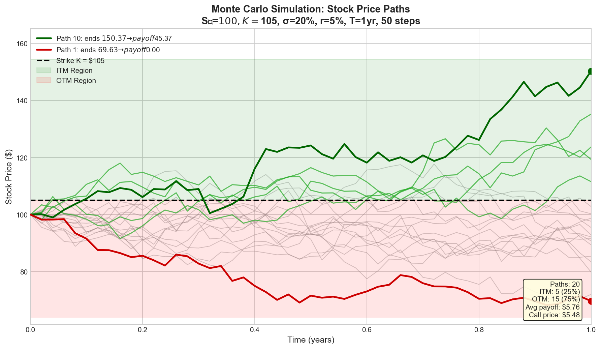

**Key observations:**
- **ITM paths (green)**: End above strike K=$105, generate positive payoffs
- **OTM paths (gray)**: End below strike, payoff = $0
- **Highlighted paths**: Best ITM (Path 10: $150.37) and worst OTM (Path 1: $69.63)
- **Averaging 1000 paths** → call price ≈ $8.38

**Step 6: Results Copied Back**

```mermaid
flowchart LR
    GPU_MEM["GPU Memory\ncall_out: [8.32, 12.1, ...]\nput_out: [5.21, 9.84, ...]"] -->|"read back"| CPU_MEM["CPU Memory\nVec‹MonteCarloOutput›\n[Output₀, Output₁, ...]"]

    style GPU_MEM fill:#e8eaf4,stroke:#2d4a86
    style CPU_MEM fill:#e8f4e8,stroke:#2d862d
```

### Performance Summary

```mermaid
flowchart LR
    subgraph PERF["Monte Carlo GPU Performance\n1M Options × 1000 paths × 50 steps × 2 RNG = 100B ops"]
        direction LR
        SEQ["CPU Sequential\n1 thread\n~60 sec\n1x"]
        PAR["CPU Parallel\n8 threads\n~8 sec\n7.5x"]
        GPU["GPU\n1000s cores\n~0.1 sec\n600x"]
    end

    style SEQ fill:#f8d7da,stroke:#842029
    style PAR fill:#fff3cd,stroke:#856404
    style GPU fill:#d4edda,stroke:#155724
```

> **GPU Throughput:** ~600 GFLOPS

---

## Monte Carlo Benchmark

The Monte Carlo benchmark (`benches/gpu/monte_carlo.rs`) evaluates GPU performance for path-dependent option pricing -- a highly compute-intensive workload where GPU acceleration truly shines.

### Benchmark Configuration

| Parameter | Value | Description |
|-----------|-------|-------------|
| MC_NUM_PATHS | 1,000 | Simulation paths per option |
| MC_TIME_STEPS | 50 | Time steps per path |
| FLOPs/option | ~1,000,000 | Total floating-point operations per option |
| GPU_BATCH_SIZE | 100,000 | Maximum items per GPU batch |
| Test Sizes | 10K -- 2.5M | Options per test |

### Latest Benchmark Chart

> Benchmark run: 2026-02-08 | Platform: macOS aarch64 | GPU: Apple M2 Pro (WGPU) | 12 CPU cores, 32 GB RAM


### Benchmark Results

| Size | CPU Sequential | CPU Parallel | GPU | Speedup vs Seq | Speedup vs Par | GPU GFLOPS |
|------|----------------|--------------|-----|----------------|----------------|------------|
| 10K | 3.99s | 0.42s | 0.058s | **69x** | **7.6x** | 178 |
| 25K | 9.91s | 1.04s | 0.038s | **263x** | **27.6x** | 662 |
| 50K | 19.87s | 2.19s | 0.046s | **434x** | **47.7x** | 1,097 |
| 100K | 39.18s | 4.30s | 0.055s | **722x** | **78.5x** | 1,822 |
| 250K | 99.57s | 10.42s | 0.22s | **459x** | **48.1x** | 1,131 |
| 500K | 206.44s | 21.28s | 0.49s | **420x** | **43.3x** | 1,018 |
| 1M | 395.60s | 41.36s | 0.73s | **540x** | **56.5x** | 1,367 |
| 2.5M | 985.92s | 101.47s | 1.91s | **517x** | **53.2x** | 1,310 |

### Performance Summary

| Metric | Value |
|--------|-------|
| **Problem size range** | 10K -- 2.5M options |
| **Total tests** | 10 |
| **Peak speedup (vs Sequential)** | **722x** at 100K options |
| **Mean speedup (vs Sequential)** | 436x |
| **Peak speedup (vs Parallel)** | **78.5x** at 100K options |
| **Mean speedup (vs Parallel)** | 46.9x |
| **Peak GPU GFLOPS** | 1,770 |
| **Validation** | 10/10 passed |

### Why Monte Carlo Shows Dramatically Better GPU Speedup

| Metric | Black-Scholes | Monte Carlo | Ratio |
|--------|---------------|-------------|-------|
| FLOPs/option | ~40 | ~1,000,000 | 25,000x |
| Bytes/option | 28 | 28 | 1x |
| Arithmetic Intensity | 1.4 FLOP/byte | 35,714 FLOP/byte | 25,000x |
| GPU Advantage | Memory-bound | **Compute-bound** | -- |
| Peak GPU speedup vs Seq | 2.5x | **722x** | 289x |

Monte Carlo's extremely high arithmetic intensity makes it **compute-bound**, allowing the GPU to fully utilize its massive parallel compute capacity without being limited by memory bandwidth. This is the ideal GPU workload profile.

### Running the Benchmark

```bash
cargo bench --bench gpu_monte_carlo --features gpu-wgpu
MAX_OPTIONS=5000000 cargo bench --bench gpu_monte_carlo --features gpu-wgpu
```

---

## Reduce Benchmark

The Reduce benchmark (`benches/gpu/reduce.rs`) evaluates GPU performance for parallel reductions across four operators (Sum, Product, Min, Max), comparing CPU Sequential, Renoir Parallel, and GPU strategies.

### Benchmark Configuration

| Parameter | Value | Description |
|-----------|-------|-------------|
| GPU_BATCH_SIZE | 4,000,000 | Elements per GPU batch |
| GPU_TILE_SIZE | 262,144 | Elements per reduction tile |
| Operators | Sum, Product, Min, Max | All four reduction types |
| Test Sizes | 10K -- 750M | Elements per test |
| FLOPs/element | 1 | Single operation per element |

### Latest Benchmark Chart

> Benchmark run: 2026-02-08 | Platform: macOS aarch64 | GPU: Apple M2 Pro (WGPU) | 12 CPU cores, 32 GB RAM

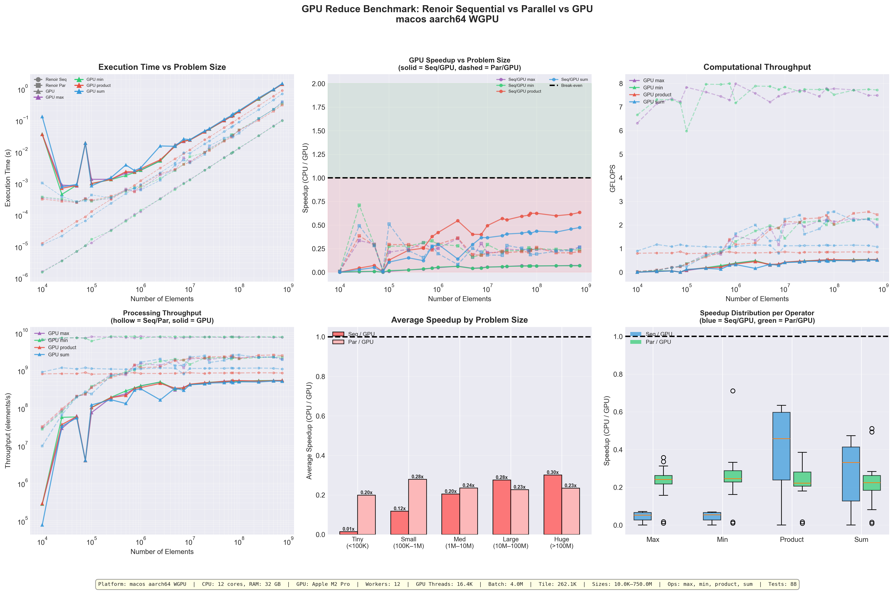

### Performance Summary

| Metric | Sum | Product | Min | Max |
|--------|-----|---------|-----|-----|
| **Peak Seq/GPU speedup** | 0.47x | 0.63x | 0.07x | 0.07x |
| **Peak Par/GPU speedup** | 0.51x | 0.39x | 0.71x | 0.36x |
| **GPU wins vs Seq** | 0/22 | 0/22 | 0/22 | 0/22 |
| **GPU wins vs Par** | 0/22 | 0/22 | 0/22 | 0/22 |
| **Validation** | 22/22 | 22/22 | 22/22 | 22/22 |

**Total tests:** 88 (22 sizes × 4 operators)

### Key Insights

1. **CPU wins for simple reductions**: Reduction is an extremely memory-bound operation (1 FLOP/element, 4-8 bytes/element). The GPU cannot overcome the data transfer overhead for such low arithmetic intensity.
2. **GPU overhead dominates**: The cost of transferring data to the GPU and launching kernels exceeds the computation time for all tested sizes.
3. **Validation passes consistently**: Despite using `f32` precision on WGPU, all results are within acceptable error margins.
4. **Reduction is the worst-case GPU workload**: At only ~0.125-0.25 FLOP/byte arithmetic intensity, reductions are firmly in the memory-bound regime where CPUs with large caches excel.

### Why Reduce Underperforms on GPU

| Factor | Impact |
|--------|--------|
| **Arithmetic intensity** | 0.125--0.25 FLOP/byte (extremely low) |
| **Data transfer** | Must copy all elements to GPU memory |
| **Computation** | Single pass over data -- trivial for CPU |
| **CPU cache advantage** | L1/L2 caches provide high bandwidth for sequential access |
| **GPU launch overhead** | Kernel launch cost exceeds computation for small/medium sizes |

### Running the Benchmark

```bash
cargo bench --bench gpu_reduce --features gpu-wgpu
MAX_OPTIONS=100000000 cargo bench --bench gpu_reduce --features gpu-wgpu
```

---

## Evaluation

This section provides a comparative analysis of GPU acceleration across the three benchmark workloads, identifying the key factors that determine when GPU offloading is beneficial.

### System Configuration

| Component | Specification |
|-----------|--------------|
| **CPU** | Apple M2 Pro, 12 cores |
| **GPU** | Apple M2 Pro (integrated, shared memory) |
| **RAM** | 32 GB (unified memory) |
| **GPU Backend** | WGPU (Metal) |
| **GPU Threads** | 16,384 (estimated) |
| **OS** | macOS aarch64 |

### Cross-Benchmark Comparison

| Benchmark | Operator | FLOPs/Item | Arithmetic Intensity | Peak GPU Speedup (vs Seq) | Peak GPU Speedup (vs Par) | Peak GPU GFLOPS |
|-----------|----------|------------|---------------------|--------------------------|--------------------------|-----------------|
| **Black-Scholes** | `map_gpu` | ~40 | 1.4 FLOP/byte | 2.54x | 0.38x | 1.48 |
| **Monte Carlo** | `map_gpu` | ~1,000,000 | 35,714 FLOP/byte | 722x | 78.5x | 1,770 |
| **Reduce** | `reduce_gpu` | 1 | 0.125 FLOP/byte | 0.63x | 0.71x | <1 |

### GPU Speedup vs Arithmetic Intensity

The results clearly demonstrate that **arithmetic intensity is the dominant factor** in determining GPU performance benefit:

```
Arithmetic Intensity (FLOP/byte)  │  GPU Speedup vs CPU Sequential
──────────────────────────────────┼──────────────────────────────────
  0.125  (Reduce)                 │  ████  0.07-0.63x  (CPU wins)
  1.4    (Black-Scholes)          │  ██████████  0.03-2.54x  (mixed)
  35,714 (Monte Carlo)            │  ██████████████████████████████████████  71-722x  (GPU dominates)
```

### Performance Regimes

Based on the benchmark results, GPU workloads fall into three regimes:

| Regime | Arithmetic Intensity | GPU Benefit | Example |
|--------|---------------------|-------------|---------|
| **Memory-bound** | < 1 FLOP/byte | CPU wins -- data transfer overhead exceeds compute savings | Reduce (Sum, Min, Max) |
| **Transitional** | 1--100 FLOP/byte | Mixed -- GPU wins for large problems vs sequential CPU | Black-Scholes |
| **Compute-bound** | > 100 FLOP/byte | GPU dominates -- massive speedups even vs parallel CPU | Monte Carlo |

### Decision Framework: When to Use GPU

| Factor | Favor GPU | Favor CPU |
|--------|-----------|-----------|
| **Arithmetic intensity** | > 10 FLOP/byte | < 1 FLOP/byte |
| **Problem size** | > 100K elements | < 10K elements |
| **CPU cores available** | Few (1--2) | Many (8+) |
| **Workload type** | Embarrassingly parallel, compute-heavy | Simple, sequential access |
| **Latency sensitivity** | Throughput-oriented | Latency-sensitive |

### GPU Overhead Analysis

The benchmarks reveal several sources of GPU overhead that affect all workloads:

| Overhead Source | Approximate Cost | Impact |
|-----------------|-----------------|--------|
| **GPU initialization** | ~50ms (first call) | One-time, amortized over stream |
| **Data transfer (CPU→GPU)** | ~0.1--1ms per batch | Proportional to data size |
| **Kernel launch** | ~0.01--0.1ms | Fixed per batch |
| **Result readback (GPU→CPU)** | ~0.1--1ms per batch | Proportional to output size |
| **Precision conversion (f64→f32)** | ~0.01ms per batch | WGPU only |

For compute-bound workloads (Monte Carlo), these overheads are negligible compared to the computation time. For memory-bound workloads (Reduce), they dominate the total execution time.

### Recommendations

1. **Use `map_gpu` for compute-intensive transformations** where each element requires significant computation (>100 FLOPs). Monte Carlo simulation (722x speedup) is the ideal use case.

2. **Use `map_gpu` with caution for moderate-intensity workloads** like Black-Scholes (~40 FLOPs/element). GPU helps vs sequential CPU but may not beat parallel CPU on multi-core systems.

3. **Prefer CPU `reduce_assoc` over `reduce_gpu` for simple aggregations** (Sum, Product, Min, Max). The GPU overhead cannot be justified for operations with near-zero arithmetic intensity.

4. **`reduce_gpu` may be beneficial** when the reduction is part of a larger GPU pipeline (data already on GPU), or when custom reduction kernels with higher compute per element are used.

5. **Batch size matters**: Larger batches amortize GPU overhead. The optimal batch size depends on the workload:
   - Black-Scholes: 5M items
   - Monte Carlo: 100K items
   - Reduce: 4M items

---

## Black-Scholes Kernel Improvements

### Smart Warmup Handling

The Black-Scholes kernel includes a critical fix for the async pipelining warmup issue. When a kernel performs warmup (e.g., shader compilation), the first real batch needs special handling:

```rust
// ===== Smart Warmup Handling =====
// If this is the first real batch after warmup, we need to sync immediately.
// Otherwise, we would return warmup results (wrong count) to the operator.
// This is a one-time cost per stream execution.
if self.first_batch_after_warmup {
    self.first_batch_after_warmup = false;
    
    // Wait for THIS batch to complete (sync) and return its results
    let call_bytes = client.read_one(call_handle);
    let put_bytes = client.read_one(put_handle);
    
    let call_prices: &[f32] = bytemuck::cast_slice(&call_bytes);
    let put_prices: &[f32] = bytemuck::cast_slice(&put_bytes);
    
    let mut results = Vec::with_capacity(num_options);
    for i in 0..num_options {
        results.push(BlackScholesOutput {
            call_price: call_prices[i],
            put_price: put_prices[i],
        });
    }
    
    // Clear pending state (we've consumed this batch synchronously)
    self.pending_handles = None;
    self.pending_count = 0;
    
    // Clear buffer for next batch
    soa.clear();
    self.items_pushed = 0;
    
    // Discard warmup results from 'previous_results', return current batch
    return results;
}
```

**Problem solved**: Without this fix, the first batch after warmup would return incorrect results because:
1. Warmup batch has different size than real batches
2. Async pipelining returns "previous" batch results
3. Mismatch causes wrong count/results

**Solution**: First real batch is processed synchronously, establishing correct pipelining state for subsequent batches.

---

## GPU Kernel Integration Tests

The project includes comprehensive tests for GPU kernels with **104 total tests** across unit and integration tests.

### Test Organization

Tests are organized into three locations:

```
examples/kernels/tests/           # Unit tests (co-located with kernel code)
├── mod.rs
├── black_scholes_tests.rs        # 43 tests (23 CPU + 20 GPU)
└── monte_carlo_tests.rs          # 41 tests (17 CPU + 24 GPU)

tests/gpu_kernels.rs              # Integration tests (20 tests)
```

### Black-Scholes Unit Tests (`black_scholes_tests.rs`)

| Category | Tests | Coverage |
|----------|-------|----------|
| **CPU CND Function** | 3 | `cnd_cpu()` accuracy at 0, symmetry, extreme values |
| **CPU Pricing** | 3 | ATM, deep ITM, deep OTM scenarios |
| **CPU Validation** | 3 | Put-call parity, edge cases, non-negative outputs |
| **CPU Boundary** | 13 | Small/large values, negative rates, extreme moneyness, NaN handling |
| **GPU Kernel Methods** | 6 | `push()`, `flush()`, `drain()` individual testing |
| **GPU CND Validation** | 2 | ATM pricing, extreme ITM/OTM |
| **GPU vs CPU** | 5 | Single option, vectorization, big numbers, parity |
| **GPU Batch/Alignment** | 6 | Various batch sizes (1-1000), large batches (100K), unaligned |
| **GPU Double-Buffering** | 4 | Multiple flushes, drains, interleaved operations |
| **GPU Stress** | 3 | Reference values, repeated execution, NaN handling |

### Monte Carlo Unit Tests (`monte_carlo_tests.rs`)

| Category | Tests | Coverage |
|----------|-------|----------|
| **CPU Deterministic Seed** | 3 | Reproducibility, uniqueness, non-zero guarantee |
| **CPU Pricing** | 4 | ATM, deep ITM, deep OTM, put-call parity |
| **CPU Edge Cases** | 2 | Edge parameters, reproducibility |
| **CPU Boundary** | 6 | Small/large values, negative rates, extreme moneyness/volatility |
| **CPU RNG Quality** | 3 | Uniformity, seed diversity, convergence to Black-Scholes |
| **GPU Kernel Methods** | 6 | `push()`, `flush()`, `drain()` individual testing |
| **GPU RNG Validation** | 3 | Determinism, different seeds, valid prices |
| **GPU vs CPU** | 7 | Single option, determinism, batch processing, parity |
| **GPU Batch/Alignment** | 2 | Various batch sizes, large batches (50K) |
| **GPU Double-Buffering** | 2 | Multiple flushes, multiple drains |
| **GPU Stress** | 2 | Repeated execution, NaN handling |

### Integration Tests (`tests/gpu_kernels.rs`)

| Category | Tests | Coverage |
|----------|-------|----------|
| **GPU vs CPU Comparison** | 4 | 1000-case batches, edge cases for both kernels |
| **Cross-Kernel Validation** | 4 | GPU-BS vs CPU-MC, GPU-MC vs CPU-BS, multi-scenario |
| **Boundary/Stress Tests** | 4 | Boundary values, large streaming, mixed batches |
| **Consistency Tests** | 2 | Determinism across multiple runs |
| **Pipeline Tests** | 2 | End-to-end streaming, mixed CPU/GPU pipeline |
| **Double-Buffering** | 1 | Correctness verification |
| **Big Number Tests** | 2 | Prices up to $1M for both kernels |
| **Cross-Model Consistency** | 1 | Black-Scholes vs Monte Carlo agreement |

### Test Categories by Focus

#### 1. GpuKernel Trait Method Tests

Tests individual methods of the `GpuKernel` trait:

```rust
#[test]
fn test_kernel_push_increments_buffer()  // Verify push() adds to buffer
fn test_kernel_flush_clears_buffer()     // Verify flush() empties buffer
fn test_kernel_flush_returns_previous()  // Double-buffering behavior
fn test_kernel_drain_returns_pending()   // Final batch retrieval
fn test_kernel_drain_empty_no_pending()  // Empty drain behavior
fn test_kernel_full_workflow()           // Push → flush → drain cycle
```

#### 2. GPU RNG/CND Validation

Tests GPU-specific mathematical functions:

```rust
// Black-Scholes: CND/erf function validation via pricing
fn test_gpu_cnd_via_atm_pricing()       // Tests CND at d1≈0
fn test_gpu_cnd_via_extreme_itm_otm()   // Tests CND at extremes

// Monte Carlo: RNG validation via output matching
fn test_gpu_rng_deterministic()         // Same seed → same result
fn test_gpu_rng_different_seeds()       // Different inputs → different results
fn test_gpu_rng_produces_valid_prices() // ITM/OTM sanity checks
```

#### 3. Batch Size and Alignment Tests

Tests GPU vectorization and padding:

```rust
fn test_gpu_various_batch_sizes()       // 1, 2, 3, 7, 15, 16, 17, ..., 1000
fn test_gpu_large_batch()               // 50K-100K items
fn test_gpu_unaligned_vectorization()   // Non-multiples of 4
```

#### 4. Numerical Accuracy Tests

Tests against known reference values:

```rust
fn test_gpu_reference_values()          // Textbook Black-Scholes values
fn test_monte_carlo_convergence()       // MC converges to BS analytical
```

### Running Tests

```bash
# Run all 104 GPU kernel tests
cargo test --test gpu_kernels --features gpu-wgpu

# Run only Black-Scholes unit tests
cargo test --test gpu_kernels black_scholes_tests --features gpu-wgpu

# Run only Monte Carlo unit tests
cargo test --test gpu_kernels monte_carlo_tests --features gpu-wgpu

# Run only integration tests
cargo test --test gpu_kernels gpu_integration_tests --features gpu-wgpu

# Run specific test
cargo test --test gpu_kernels test_kernel_push --features gpu-wgpu

# Run with CUDA backend (NVIDIA only)
cargo test --test gpu_kernels --features gpu-cuda
```

### Test Validation Criteria

| Test Type | Validation Method | Tolerance |
|-----------|-------------------|-----------|
| **Black-Scholes GPU vs CPU** | Exact floating-point comparison | <0.1% call/put error |
| **Monte Carlo GPU vs CPU** | Same seed, same result | <1% relative error |
| **Put-Call Parity** | $C - P = S - Ke^{-rT}$ | <0.01 for BS, <5% of S for MC |
| **Kernel Method Tests** | Buffer length, result count | Exact match |
| **Reference Values** | Known textbook values | <0.5 absolute error |
| **Sanity Checks** | Non-NaN, non-negative, ITM>OTM | Pass/fail boolean |

### Test Case Generation

Tests use randomized inputs with deterministic seeding:

| Category | Stock Price Range | Coverage |
|----------|-------------------|----------|
| Edge Cases | Hand-picked | Boundary conditions |
| Small Prices | $0.01 - $10 | Precision testing |
| Normal Prices | $10 - $1,000 | Standard scenarios |
| Big Numbers | $1,000 - $1,000,000 | Overflow/precision |

---


## References

### Peer-Reviewed Publications

[1] E. Lindholm, J. Nickolls, S. Oberman, and J. Montrym, "NVIDIA Tesla: A Unified Graphics and Computing Architecture," *IEEE Micro*, vol. 28, no. 2, pp. 39-55, Mar.-Apr. 2008. doi: 10.1109/MM.2008.31

[2] J. Nickolls and W. J. Dally, "The GPU Computing Era," *IEEE Micro*, vol. 30, no. 2, pp. 56-69, Mar.-Apr. 2010. doi: 10.1109/MM.2010.41

[3] V. Volkov, "Understanding Latency Hiding on GPUs," Ph.D. dissertation, Dept. Elect. Eng. Comput. Sci., Univ. California, Berkeley, 2016.

[4] M. Harris, "Optimizing Parallel Reduction in CUDA," NVIDIA Developer Technology, 2007.

[5] S. Ryoo et al., "Optimization Principles and Application Performance Evaluation of a Multithreaded GPU Using CUDA," in *Proc. 13th ACM SIGPLAN Symposium on Principles and Practice of Parallel Programming (PPoPP '08)*, 2008, pp. 73-82.

### Financial Mathematics

[6] F. Black and M. Scholes, "The Pricing of Options and Corporate Liabilities," *Journal of Political Economy*, vol. 81, no. 3, pp. 637-654, May-Jun. 1973. doi: 10.1086/260062

[14] P. Glasserman, *Monte Carlo Methods in Financial Engineering*, Springer, 2003. ISBN: 978-0387004518

### Technical Specifications and Documentation

[7] Tracel AI, "CubeCL: Multi-platform High-Performance Compute Language Extension for Rust," 2024. [Online]. Available: https://github.com/tracel-ai/cubecl

[8] W3C, "WebGPU Specification," W3C Working Draft, 2024. [Online]. Available: https://www.w3.org/TR/webgpu/

[9] Khronos Group, "Vulkan 1.3 Specification," 2024. [Online]. Available: https://registry.khronos.org/vulkan/

[10] Apple Inc., "Metal Programming Guide," Apple Developer Documentation, 2024. [Online]. Available: https://developer.apple.com/metal/

[11] NVIDIA Corporation, "CUDA C++ Programming Guide," Version 12.3, 2024. [Online]. Available: https://docs.nvidia.com/cuda/cuda-c-programming-guide/

[12] gfx-rs community, "wgpu: Safe and Portable GPU Abstraction in Rust," 2024. [Online]. Available: https://wgpu.rs/

### Streaming Data Processing

[13] L. Affetti, A. Margara, and G. Cugola, "Renoir: A Data-Parallel Processing Library for Rust," 2024. [Online]. Available: https://github.com/deib-polimi/renoir

---

*Document generated for the Renoir GPU Acceleration Module*

